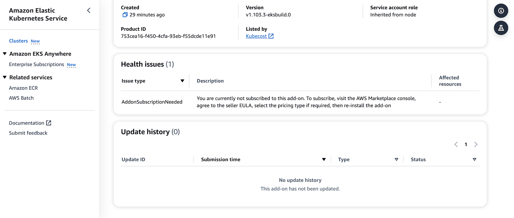
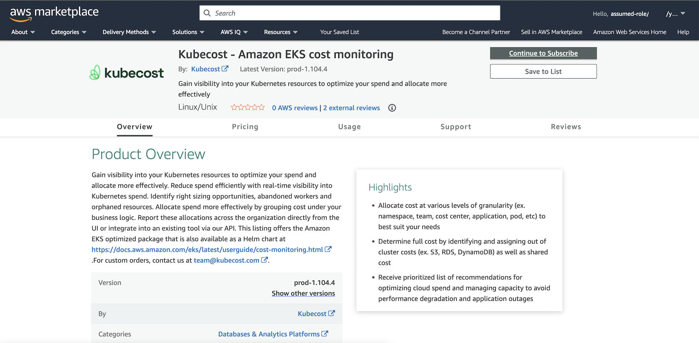

[[English](README.md)] [[한국어](README.ko.md)]

# Amazon EKS (Elastic Kubernetes Service)
[Amazon EKS](https://aws.amazon.com/eks/) is a fully managed Kubernetes service. Customers trust EKS to run their most sensitive and mission critical applications because of its security, reliability, and scalability.

* This module will create an EKS cluster on AWS. It will have a control plane and you can register multiple heterogeneous node groups as data plane.
* This module will give you a utility bash script to set up a kubernetes configuration file to access the EKS cluster.
* This module has several sub-modules to deploy kubernetes controllers and utilities using helm provider.

## Examples
- [Amazon EKS Blueprint](https://github.com/Young-ook/terraform-aws-eks/tree/main/examples/blueprint)
- [Analytics on AWS](https://github.com/Young-ook/terraform-aws-emr/tree/main/examples/blueprint)
- [AWS FIS Blueprint (Chaos Engineering)](https://github.com/Young-ook/terraform-aws-fis/blob/main/examples/blueprint)
- [Data on Amazon EKS](https://github.com/Young-ook/terraform-aws-eks/blob/main/examples/data-ai)

## Getting started
### AWS CLI
Follow the official guide to install and configure profiles.
- [AWS CLI Installation](https://docs.aws.amazon.com/cli/latest/userguide/cli-chap-install.html)
- [AWS CLI Configuration](https://docs.aws.amazon.com/cli/latest/userguide/cli-configure-profiles.html)

After the installation is complete, you can check the aws cli version:
```
aws --version
aws-cli/2.5.8 Python/3.9.11 Darwin/21.4.0 exe/x86_64 prompt/off
```

### Terraform
Terraform is an open-source infrastructure as code software tool that enables you to safely and predictably create, change, and improve infrastructure.

#### Install
This is the official guide for terraform binary installation. Please visit this [Install Terraform](https://learn.hashicorp.com/tutorials/terraform/install-cli) website and follow the instructions.

Or, you can manually get a specific version of terraform binary from the websiate. Move to the [Downloads](https://www.terraform.io/downloads.html) page and look for the appropriate package for your system. Download the selected zip archive package. Unzip and install terraform by navigating to a directory included in your system's `PATH`.

Or, you can use [tfenv](https://github.com/tfutils/tfenv) utility. It is very useful and easy solution to install and switch the multiple versions of terraform-cli.

First, install tfenv using brew.
```
brew install tfenv
```
Then, you can use tfenv in your workspace like below.
```
tfenv install <version>
tfenv use <version>
```
Also this tool is helpful to upgrade terraform v0.12. It is a major release focused on configuration language improvements and thus includes some changes that you'll need to consider when upgrading. But the version 0.11 and 0.12 are very different. So if some codes are written in older version and others are in 0.12 it would be great for us to have nice tool to support quick switching of version.
```
tfenv list
tfenv install latest
tfenv use <version>
```

### Kubernetes CLI
Here is a simple way to install the kubernetes command line tool on your environment if you are on macOS.
```
brew install kubernetes-cli
```

For more information about kubernetes tools, please visit this [page](https://kubernetes.io/docs/tasks/tools/) and follow the **kubectl** instructions if you want to install tools.

### Setup
```hcl
module "eks" {
  source  = "Young-ook/eks/aws"
  name    = "eks"
  tags    = { env = "test" }
}
```
Run terraform:
```
terraform init
terraform apply
```
## Generate kubernetes config
This terraform module provides users with a shell script that extracts the kubeconfig file of the EKS cluster. When users run the terraform init command in their workspace, the script is downloaded with the terraform module from the terraform registry. And After terraform apply, a user can see how to run this script in terraform output, and it looks like below. To download the kubernetes config file into your (local) workspace, copy the bash shell from the terraform outputs and export the downloaded file as an environment variable.
```
bash -e .terraform/modules/eks/script/update-kubeconfig.sh -r ap-northeast-2 -n eks-example -k kubeconfig
export KUBECONFIG=kubeconfig
```

Using this script, you can easily obtain a kubeconfig file for access the their EKS cluster. For your information, the original script is here [update-kubeconfig.sh](https://github.com/Young-ook/terraform-aws-eks/blob/main/script/update-kubeconfig.sh) and you can check out the details of the script.

**[Important]** Before you run this script you must configure your local environment to have proper permission to get the credentials from EKS cluster on your AWS account whatever you are using aws-cli or aws-vault.

## IAM Role for Service Account
After then you will see the created EKS cluster and node groups and IAM role. For more information about configuration of service account mapping for IAM role in Kubernetes, please check out the [IAM Role for Service Accounts](https://github.com/Young-ook/terraform-aws-eks/blob/main/modules/irsa/README.md)

# Known Issues
## Unauthorized
You might get an error message when this module tries to create a `aws-auth` configuration map for a new EKS cluster. When prompted, re-apply the terraform configuration. Here is an example error message:
```
module.eks.kubernetes_config_map.aws-auth[0]: Creating...

Error: Unauthorized

  on .terraform/modules/eks/main.tf line 341, in resource "kubernetes_config_map" "aws-auth":
 341: resource "kubernetes_config_map" "aws-auth" {
```

## Configmap already exist
If you are trying to replace a managed nodegroup with a (self-managed) nodegroup, you may get an error message as this module tries to generate the `aws-auth` config map. This is because the managed nodegroup resource does not delete the `aws-auth` configmap when it is removed, but the self-managed nodegroup needs the `aws-auth` configmap for node registration, which causes a conflict. When prompted, delete exsiting `aws-auth` configmap using kubectl and retry the terraform apply command. Here is an example error message:
```
module.eks.kubernetes_config_map.aws-auth[0]: Creating...

Error: configmaps "aws-auth" already exists

  on .terraform/modules/eks/main.tf line 343, in resource "kubernetes_config_map" "aws-auth":
 343: resource "kubernetes_config_map" "aws-auth" {
```

## Invalid apiVersion
You might see an *invalid apiVersion* error message when you try to run your kubernetes-cli command after cli upgrade
```
error: exec plugin: invalid apiVersion "client.authentication.k8s.io/v1alpha1"
```

To fix this issue, you probably need to downgrade to 1.23.6. Download the *kubectl* binary file. Then, make it executable and replace it with the exisiting *kubectl* binary. This is an example that shows you How to do that on you Intel macOS. If you are using Apple Silicon M1, try changing the architecture parameter to *arm64*.
```
curl -LO "https://dl.k8s.io/release/v1.23.6/bin/darwin/amd64/kubectl"
```

## Marketplace Subscription
The first time you try to install the *kubecost* EKS add-on, you might see a *CREATE_FAILED* error message, because kubecost is a third-party application and you might have to pay for it.

```
Error: waiting for EKS Add-On (eks-rkrdi:kubecost_kubecost) create: unexpected state 'CREATE_FAILED', wanted target 'ACTIVE'. last error: 1 error occurred:
│ 	* : AddonSubscriptionNeeded: You are currently not subscribed to this add-on. To subscribe, visit the AWS Marketplace console, agree to the seller EULA, select the pricing type if required, then re-install the add-on
│
│
│
│   with module.kubernetes-addons.module.eks-addons.aws_eks_addon.addon["kubecost_kubecost"],
│   on .terraform/modules/kubernetes-addons.eks-addons/modules/eks-addons/main.tf line 2, in resource "aws_eks_addon" "addon":
│    2: resource "aws_eks_addon" "addon" {
```


To subscribe, you should visit the AWS Marketplace console, agree to the seller EULA, select the pricing type if required, then re-install the add-on.


# Additional Resources
## Amazon EKS
- [Amazon EKS Best Practices Guides](https://aws.github.io/aws-eks-best-practices/)
- [Amazon EKS troubleshooting](https://docs.aws.amazon.com/eks/latest/userguide/troubleshooting.html)
- [EKS Workshop](https://www.eksworkshop.com/)
- [Seamlessly Migrate Workloads from EKS Self-managed node groups to managed node groups](https://aws.amazon.com/blogs/containers/seamlessly-migrate-workloads-from-eks-self-managed-node-group-to-eks-managed-node-groups/)

## Amazon VPC (Virtual Private Cloud)
- [Amazon VPC Terraform Module](https://github.com/Young-ook/terraform-aws-vpc)

## Kubernetes
### Operator
- [Operator pattern](https://kubernetes.io/docs/concepts/extend-kubernetes/operator/)
