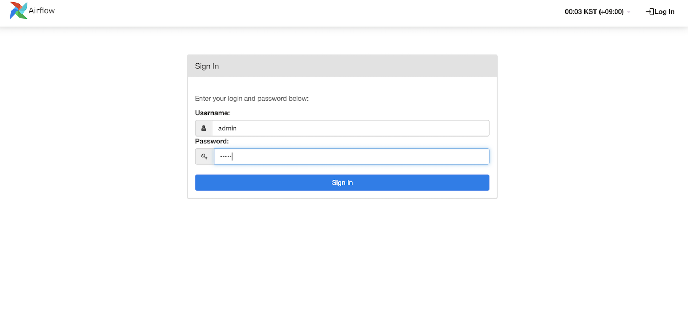
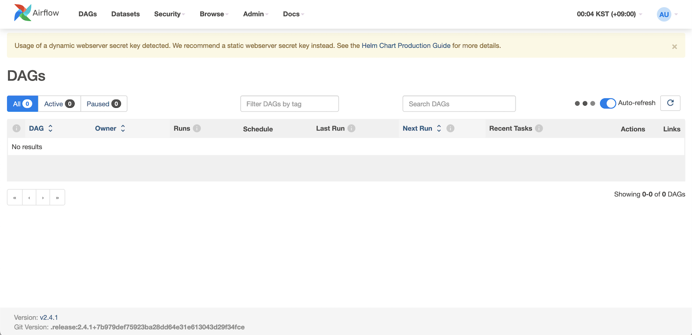

[[English](README.md)] [[한국어](README.ko.md)]

# Amazon EMR (Elastic Map Reduce) on Amazon EKS
[Amazon EMR](https://aws.amazon.com/emr/) is a managed cluster platform that simplifies running big data frameworks, such as Apache Hadoop and Apache Spark, on AWS to process and analyze vast amounts of data. With this deployment, you can easily run and scale Apache Spark, Hive, Presto, and other big data workloads with Amazon EMR.


Amazon EMR on Amazon EKS decouples the analytics job from the services and infrastructure that are processing the job by using a container-based approach. You can focus more on developing your application and less on operating the infrastructure as EMR on EKS dynamically configures the infrastructure based on the compute, memory, and application dependencies of the job. Infrastructure teams can centrally manage a common compute platform to consolidate EMR workloads with other container-based applications. Multiple teams, organizations, or business units can simultaneously and independently run their analytics processes on the shared infrastructure while maintaining isolation enabled by Amazon EKS and AWS Identity and Access Management (IAM). When you submit a job to Amazon EMR, your job definition contains all of its application-specific parameters. Amazon EMR uses these parameters to instruct Amazon EKS about which pods and containers to deploy. Amazon EKS then brings online the computing resources from Amazon EC2 and AWS Fargate required to run the job. With this loose coupling of services, you can run multiple, securely isolated jobs simultaneously. You can also benchmark the same job with different compute backends or spread your job across multiple Availability Zones to improve availability.

The following diagram illustrates how Amazon EMR on EKS works with other AWS services.


If you already use Amazon EMR, you can now run Amazon EMR based applications with other types of applications on the same Amazon EKS cluster. This deployment option also improves resource utilization and simplifies infrastructure management across multiple Availability Zones. If you already run big data frameworks on Amazon EKS, you can now use Amazon EMR to automate provisioning and management, and run Apache Spark more quickly.

If you already run Apache Spark on Amazon EKS, you can get all of the benefits of Amazon EMR like automatic provisioning and scaling and the ability to use the latest fully managed versions of open source big data analytics frameworks. You get an optimized EMR runtime for Apache Spark with 3X faster performance than open source Apache Spark on EKS, a serverless data science experience with EMR Studio and Apache Spark UI, fine grained data access control, and support for data encryption. Your Spark jobs start in seconds vs minutes when compared to EC2 based deployments.

The following diagram shows the two different deployment models for Amazon EMR.


## Setup
### Prerequisites
This module requires *eksctl* which is an open-source cli tool for EKS cluster management. In this example, we will use *eksctl* to create kubernetes access control objects for EMR integration. Follow the [instructions](https://github.com/weaveworks/eksctl#installation) for eksctl installation. And if you don't have the terraform and kubernetes tools in your environment, go to the main [page](https://github.com/Young-ook/terraform-aws-eks) of this repository and follow the installation instructions.

### Download
Download this example on your workspace
```
git clone https://github.com/Young-ook/terraform-aws-eks
cd terraform-aws-eks/examples/analytics
```

Then you are in **analytics** directory under your current workspace. There is an exmaple that shows how to use terraform configurations to create and manage an EKS cluster and Addon utilities on your AWS account.

Run terraform:
```
terraform init
terraform apply -target module.airflow
```

### Update kubeconfig
We need to get kubernetes config file for access the cluster that we've made using terraform. After terraform apply, you will see the bash command on the outputs. These scripts will help you setup your virtual EMR cluster on your EKS cluster. It looks like below.
```
Outputs:

enable_emr_access = "eksctl create iamidentitymapping --cluster eks-emr --service-name emr-containers --namespace default"
kubeconfig = "bash -e .terraform/modules/eks/script/update-kubeconfig.sh -r ap-northeast-2 -n eks-emr -k kubeconfig"
```

For more details about *kubeconfig* script, please refer to the [user guide](https://github.com/Young-ook/terraform-aws-eks#generate-kubernetes-config).

This is an example:
```
bash -e .terraform/modules/eks/script/update-kubeconfig.sh -r ap-northeast-2 -n eks-emr -k kubeconfig
export KUBECONFIG=kubeconfig
```

### Enabling access for Amazon EMR
In order to allow EMR to perform operations on the Kubernetes API, its Service-Linked Role (SLR) needs to be granted the required RBAC permissions. *eksctl* provides a command that creates the required RBAC resources for EMR, and updates the aws-auth ConfigMap to bind the role with the SLR for EMR. Copy the command from terraform outputs and paste it to the your workspace for run:
```
eksctl create iamidentitymapping --cluster eks-emr --service-name emr-containers --namespace default
```

### Create an EMR virtual cluster
Run terraform:
```
terraform apply -target module.emr
```

### Access Airflow
Run below command to check the status.
```
kubectl -n airflow get all
```

Everything looks good, move forward to the next step. Run port-forward commend to access airflow dashboard:
```
kubectl -n airflow port-forward svc/airflow-webserver 8080:8080
```

Open `localhost:8080` in your favorite browswer. You will see the login page.

**[WARNING]** In this example, we use a default user (`admin`) and password (`admin`). For any production airflow deployment, you should change the default password.




## Clean up
To destroy all infrastrcuture, run terraform:
```
terraform destroy
```

If you don't want to see a confirmation question, you can use quite option for terraform destroy command
```
terraform destroy --auto-approve
```

**[DON'T FORGET]** You have to use the *-var-file* option when you run terraform destroy command to delete the aws resources created with extra variable files.
```
terraform destroy -var-file fixture.tc1.tfvars
```

# Additional Resources
## Amazon EMR on Amazon EKS
- [Amazon EMR on Amazon EKS Developer Guide](https://docs.aws.amazon.com/emr/latest/EMR-on-EKS-DevelopmentGuide/emr-eks.html)
- [Best practices for running Spark on Amazon EKS](https://aws.amazon.com/blogs/containers/best-practices-for-running-spark-on-amazon-eks/)
- [Run Apache Spark with Amazon EMR on EKS backed by Amazon FSx for Lustre storage](https://aws.amazon.com/blogs/big-data/run-apache-spark-with-amazon-emr-on-eks-backed-by-amazon-fsx-for-lustre-storage/)
- [Troubleshooting Amazon EMR on EKS identity and access](https://docs.aws.amazon.com/emr/latest/EMR-on-EKS-DevelopmentGuide/security_iam_troubleshoot.html)
