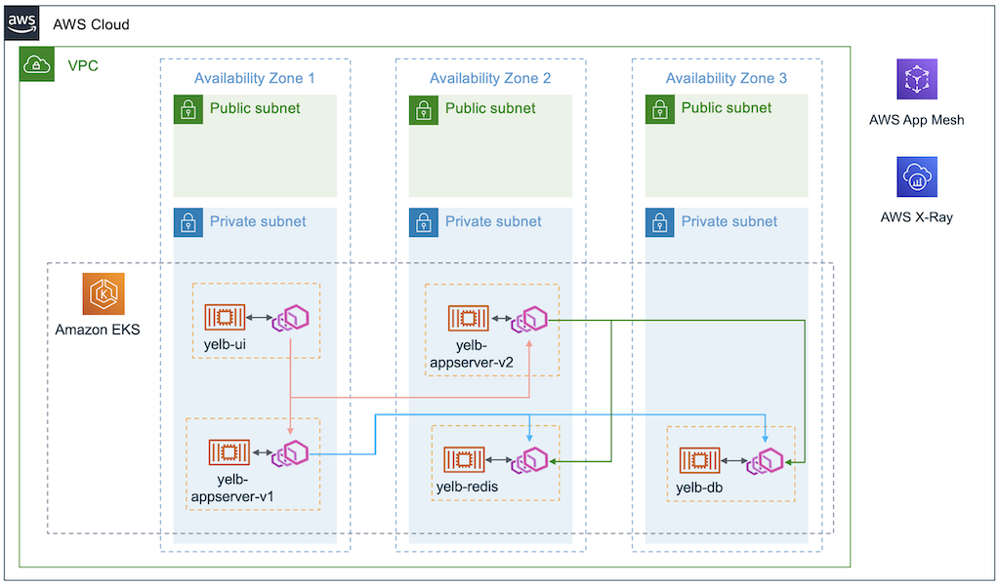

# AWS App Mesh

## Download example
Download this example on your workspace
```sh
git clone https://github.com/Young-ook/terraform-aws-eks
cd terraform-aws-eks/examples/app-mesh
```

## Setup
[This](https://github.com/Young-ook/terraform-aws-eks/blob/main/examples/app-mesh/main.tf) is the example of terraform configuration file to create a managed EKS on your AWS account and install AWS App Mesh controller using Helm chart to the EKS cluster. Check out and apply it using terraform command.

Run terraform:
```sh
terraform init
terraform apply
```
Also you can use the `-var-file` option for customized paramters when you run the terraform plan/apply command.
```sh
terraform plan -var-file tc1.tfvars
terraform apply -var-file tc1.tfvars
```

### Update kubeconfig
Update and download kubernetes config file to local. You can see the bash command like below after terraform apply is complete. The output looks like below. Copy and run it to save the kubernetes configuration file to your local workspace. And export it as an environment variable to apply to the terminal.
```sh
bash -e .terraform/modules/eks/script/update-kubeconfig.sh -r ap-northeast-2 -n eks-appmesh -k kubeconfig
export KUBECONFIG=kubeconfig
```

## AWS App Mesh
[AWS App Mesh](https://aws.amazon.com/app-mesh/) is a service mesh that provides application-level networking to make it easy for your services to communicate with each other across multiple types of compute infrastructure. App Mesh gives end-to-end visibility and high-availability for your applications.

Run terraform.
After provisioning, you can check the app mesh controller on your EKS cluster. If the output message contains a resource like 'appmesh-controller', then the app mesh controller is running properly. For more details, please refer to [this](https://github.com/Young-ook/terraform-aws-eks/tree/main/modules/app-mesh).
```sh
kubectl -n appmesh-system get all
```

### App Mesh example


#### Deploy
```sh
kubectl apply -f yelb.yaml
```

#### Access the example
##### Local Workspace
In your local workspace, connect through a proxy to access your application's endpoint.
```sh
kubectl -n yelb port-forward svc/yelb-ui 8080:80
```
Open `http://localhost:8080` on your web browser. This shows the application main page.

##### Cloud9
In your Cloud9 IDE, run the application.
```sh
kubectl -n yelb port-forward svc/yelb-ui 8080:80
```
Click `Preview` and `Preview Running Application`. This opens up a preview tab and shows the application main page.


### Delete
```sh
kubectl delete -f yelb.yaml
```

## Clean up
Run terraform:
```
terraform destroy
```
Or if you only want to remove all resources of App Mesh Controller from the EKS clsuter, you can run terraform destroy command with `-target` option:
```
terraform destroy -target module.app-mesh
```
Don't forget you have to use the `-var-file` option when you run terraform destroy command to delete the aws resources created with extra variable files.
```
terraform destroy -var-file tc1.tfvars
```
