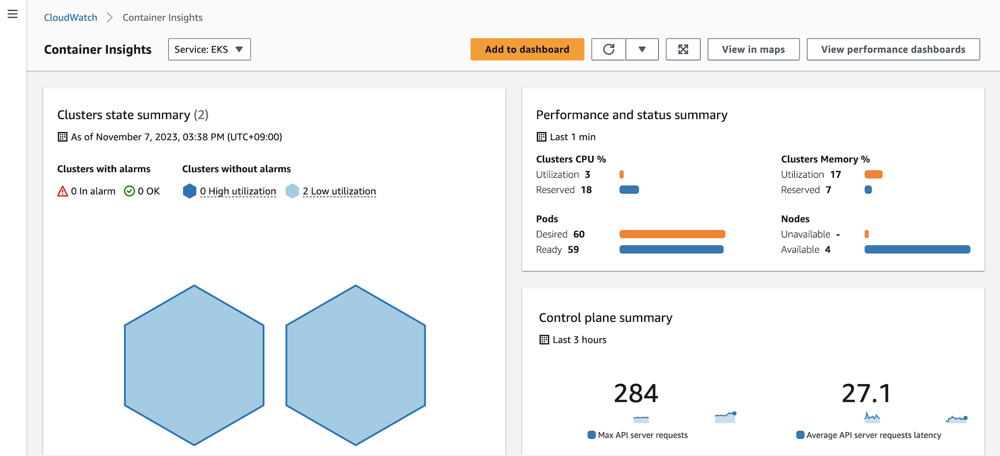
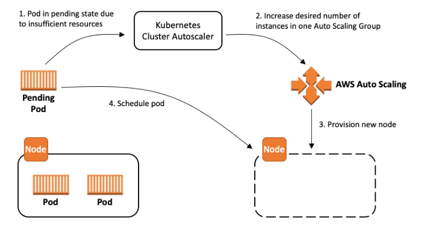

[[English](README.md)] [[한국어](README.ko.md)]

# EKS 블루프린트(Blueprint)
EKS 블루프린트는 쿠버네티스 워크로드를 배포하고 운영하기 위해 필요한 소프트웨어를 자동으로 설정하는 과정을 돕는 예제입니다. EKS 블루프린트를 활용하면, 여러 분이 원하는 설정의 EKS 실행환경을 인프라스트럭처 코드(Infrastructure as Code, IaC)의 템플릿/청사진 형태로 만들 수 있습니다.
한 번 블루프린트를 설정했다면, 여러 분은 젠킨스(Jenkins) 또는 코드파이프라인(CodePipeline)과 같은 자동화 도구를 활용하여 필요에 따라 여러 AWS 계정 또는 리전에 EKS 클러스터를 찍어낼 수 있습니다. 또한 여러 분은 EKS 블루프린트를 활용하여 널리 알려진 오픈소스 도구인 프로메테우스(Prometheus), 카펜터(Karpenter), 엔진엑스(Nginx), 트래픽(Traefik), AWS 로드발란서 컨트롤러 (AWS Load Balancer Controller), 플루언트 비트(Fluent Bit), 케다(KEDA), 아르고씨디(ArgoCD) 등을 추가 구성 요소 (Add-ons)로 포함하여 EKS 클러스터를 쉽게 구축할 수 있습니다. 그리고 EKS 블루프린트는 여러 분이 동일한 클러스터를 여러 팀에게 제공해야 하는 워크로드를 운영해야 할 때 필요한 보안관련 사항들을 쉽게 구축하는 것을 도와줍니다.

## 설치
### 필수요소
이 예제에서는 쿠브쿠틀(kubectl, 쿠버네티스 명령줄 도구)가 필요합니다. 만약, 테라폼(terraform)과 쿠브쿠틀(kubectl)이 여러 분의 환경에 없다면, 메인 [페이지](https://github.com/Young-ook/terraform-aws-eks#README.md)의 안내에 따라 설치하시기 바랍니다.

### 내려받기
여러 분의 작업 환경에 예제를 내려받기 합니다.
```
git clone https://github.com/Young-ook/terraform-aws-eks
cd terraform-aws-eks/examples/blueprint
```

작업이 끝나면 **blueprint** 디렉토리를 볼 수 있습니다. 디렉토리 안에 있는 예제에는 EKS 클러스터와 추가 요소를 설치하고 관리하기 위한 테라폼 설정 파일과 기타 자원이 있습니다. 다음 단계로 넘어가기 전에 테라폼과 쿠브쿠틀이 제대로 설치 되어 있는 지 확인합니다. 완료하였다면, 다음 단계로 이동합니다.

테라폼을 실행합니다:
```
terraform init
terraform apply
```
또는, *-var-file* 옵션을 활용하여 원하는 파라메터를 전달할 수 있습니다.
```
terraform plan -var-file fixture.tc1.tfvars
terraform apply -var-file fixture.tc1.tfvars
```

### 쿠버네티스 환경설정
테라폼을 이용해서 생성한 클러스터에 접속하기 위해서는 쿠버네티스 설정 파일을 받아야 합니다. 테라폼 실행이 끝나면 설정 파일을 내려받을 수 있는 스크립트가 출력됩니다. 보다 자세한 내용은, 다음의 [사용자 안내](https://github.com/Young-ook/terraform-aws-eks#generate-kubernetes-config)를 참고하시기 바랍니다.

## 쿠버네티스 컨트롤러(Kubernetes Controllers)
### 앱 메시 컨트롤러(AWS App Mesh Controller)
[앱 메시(AWS App Mesh)](https://aws.amazon.com/app-mesh/)는 다양한 종류의 컴퓨팅 인프라스크럭처를 넘나드는 서비스 사이의 통신을 쉽게 만들어 주는 애플리케이션 수준의 네트워킹을 제공하는 서비스 메시 서비스 입니다. 앱 메시는 당신의 애플리케이션에 종단간 가시성과 고가용성을 제공합니다.

#### 앱 메시 컨트롤러(App Mesh Controller) 설치 확인
모든 설치 단계가 끝나면, *kube-system* 네임스페이스 안의 모든 포드(Pod)들의 상태가 *Ready* 일 것입니다. 특히, *appmesh-controller* 포드가 정상인 지 확인하시기 바랍니다.
```
kubectl -n kube-system get po
```
결과가 다음과 비슷하면, 정상 동작하는 것입니다.
```
NAME                                            READY   STATUS    RESTARTS   AGE
pod/appmesh-controller-xxxxxxxxx-xxxxx          1/1     Running   0          10h
```

앱 메시 연동을 위한 개인화 자원 정의(Custom Resource Definition, CRD)도 확인할 수 있습니다.
```
kubectl get crds | grep appmesh
```

예상 결과는 아래와 같습니다:
```
gatewayroutes.appmesh.k8s.aws
meshes.appmesh.k8s.aws
virtualgateways.appmesh.k8s.aws
virtualnodes.appmesh.k8s.aws
virtualrouters.appmesh.k8s.aws
virtualservices.appmesh.k8s.aws
```

### 로드 발란서 컨트롤러(AWS Load Balancer Controller)
로드 발란서 컨트롤러(AWS Load Balancer Controller)는 쿠버네티스에서 AWS 로드발란서를 관리하기 위한 도구 입니다.
- 쿠버네티스 인그레스(Ingress)로서 애플리케이션 로드 발란서(Application Load Balancer, ALB)를 생성합니다.
- 쿠버네티스 서비스(Ingress)로서 네트워크 로드 발란서(Network Load Balancer, NLB)를 생성합니다.

여러 분은 AWS Application Load Balancer (ALB) 를 활용하여 포드들에게 애플리케이션 트래픽을 분산시킬 수 있습니다. 자세한 내용을 배우려면, [애플리케이션 로드 발란서란 무엇인가?](https://docs.aws.amazon.com/elasticloadbalancing/latest/application/introduction.html) 에서 애플리케이션 로드 발란서 사용자 안내를 살펴보시길 바랍니다. 여러 분은 인그레스 그룹(Ingress group)을 이용하여 ALB를 쿠버네티스 클러스터의 애플리케이션에게 공유할 수 있습니다. 과거에는, 개발 애플리케이션마다 개별 ALB를 사용해야 했었습니다. 컨트롤러는 자동적으로 AWS ALB를 쿠버네티스 인그레스에 대응하여 프로비저닝 합니다. ALB는 AWS Fargate에 실행되는 포드와도 동작합니다. 여러 분은 ALB를 퍼블릭 또는 프라이빗 서브넷에 만들 수 있습니다.

[AWS 로드 발란서 컨트롤러](https://github.com/kubernetes-sigs/aws-load-balancer-controller) (예전 이름은 AWS ALB 인그레스 컨르롤러였습니다) 쿠버네티스 클러스터에서 kubernetes.id/ingress.class: alb annotation을 통하여 인그레스 자원을 생성하려고 할 때, 이에 대응하여 ALB와 필요한 AWS 자원을 함께 생성합니다. 인그레스 자원은 ALB에서 HTTP또는 HTTPS 통신을 클러스터의 여러 다른 포드들에게 전달하도록 설정합니다. 인그레스 개체가 AWS 로드 발란서 컨트롤러를 사용하도록 만들기 위해서 다음의 어노테이션(Annotation)을 쿠버네티스 인그레스 사양에 추가합니다. 보다 자세한 정보는 GitHub의 [Ingress specification](https://kubernetes-sigs.github.io/aws-load-balancer-controller/guide/ingress/spec/)를 참조하시길 바랍니다.

#### 로드 발란서 컨트롤러(AWS Load Balancer Controller) 설치 확인
모든 설치 과정이 끝났다면, *kube-system* 네임스페이스에서 설치한 포드의 상태가 *Ready* 인 지 확인할 수 있습니다. *aws-load-balancer-controller* 포드가 잘 생성되었고 문제없이 동작하는 지 확인합니다:

```
kubectl get deploy -n kube-system aws-load-balancer-controller
```

만약, 정상적인 상태가 아니라면, 로그를 확인해서 원인을 분석할 수 있습니다:
```
kubectl -n kube-system logs aws-load-balancer-controller-7dd4ff8cb-wqq58
```

### 클라우드 와치 컨테이너 인사이츠(Amazon CloudWatch Container Insights)
[Amazon 클라우드 와치](https://aws.amazon.com/cloudwatch/)는 AWS, 온프레미스, 그리고 다른 클라우드의 애플리케이션과 자원을 모니터링하는 서비스입니다. 클라우드 와치는 여러 분의 인프라스트럭처와 애플리케이션을 운영하기 위해 필요한 로그, 지표, 이벤트 정보 등을 수집하고 시각화하여 대시보드에 표시합니다. 클라우드 와치는 자동으로 수 많은 자원의 프로세서, 메모리, 디스크, 네트워크 지표를 자동으로 수집합니다.

또한 [Amazon 클라우드 와치 컨테이너 인사이츠](https://docs.aws.amazon.com/AmazonCloudWatch/latest/monitoring/ContainerInsights.html) 여러 분의 마이크로서비스와 컨테이너 애플리케이션의 지표와 로그를 수집 및 요약해 줍니다. 컨테이너 인사이츠는 Amazon ECS, Amazon EKS, 그리고 Amazon EC2 위에서 실행되는 쿠버네티스를 지원합니다. Amazon ECS 지원항목에 서버리스 컴퓨팅 환경인 AWS Fargate에 대한 지원도 포함되어 있습니다. 컨테이너 인사이츠는 또한 컨테이너 재시작 실패와 같은 진단 정보를 제공하여 여러 분이 문제를 빠르게 격리하고 해결할 수 있도록 돕습니다. 또한, 여러 분은 컨터이너 인사이츠에서 수집한 지표를 활용하여 클라우드 와치 알람을 발생시킬 수도 있습니다.



#### 클라우드 와치와 플로언트비트(FluentBit) 애이전트 설치 확인
모든 설치 절차가 완료되었다면, 쿠버네티스 *amazon-cloudwatch* 네임스페이스의 모든 포드가 *Ready* 상태인 지 확인해보고, *cloudwatch-agent*, *fluent-bit* 가 존재하는 지 확인합니다.
```
NAME                                                              READY   STATUS    RESTARTS   AGE
amazon-cloudwatch-observability-controller-manager-5f84466r6p92   1/1     Running   0          29m
cloudwatch-agent-8rjmt                                            1/1     Running   0          29m
cloudwatch-agent-f7rn8                                            1/1     Running   0          29m
cloudwatch-agent-pdn9h                                            1/1     Running   0          29m
cloudwatch-agent-zxk7r                                            1/1     Running   0          29m
fluent-bit-264ws                                                  1/1     Running   0          29m
fluent-bit-sgj5d                                                  1/1     Running   0          29m
fluent-bit-vgsgc                                                  1/1     Running   0          29m
fluent-bit-xhxq8                                                  1/1     Running   0          29m
```

### 노드 종료 핸들러(AWS Node Termination Handler)
[AWS 노드 종료 핸들러](https://github.com/aws/aws-node-termination-handler) EC2 유지보수 이벤트, EC2 스폿 중단, 오토스케일링 스케일 인(Scale-In), 오토스케일링 가용영역 분산배치 재조정, EC2 인스턴스 종료 등과 같이 EC2 인스턴스가 사용 불가능해지는 상황이 발생했을 때 쿠버티네스 관리자가 적절한 대응을 수행할 수 있도록 만드는 프로젝트 입니다. 노드 종료 핸들러는 AWS로부터 쿠버네티스로 전달되는 노드 종료 요청사이를 연결하여 인터럽션(interruption) 알림을 받은 노드가 덜컹거림 없이 부드럽게 진행 중인 작업을 마무리 할수 있도록 합니다. 노드 종료 핸들러는 쿠버네티스 사용자와 API를 사용하여 종료 대상이 되는 노드를 정리하고 수습하는 작업을 수행합니다. 보다 자세한 내용 또는 사용법은 GitHub 페이지에 있습니다.

#### 노드 종료 핸들러 확인
모든 절자가 완료되면, *kube-system* 네임스페이스의 모든 자원의 상태가 *Ready* 인 지 확인합니다. 다음과 같이 *aws-node-termination-hander* 포드가 실행 중이어야 합니다:
```
kubectl -n kube-system get po
```
```
NAME                                          READY   STATUS    RESTARTS   AGE
aws-node-xxxxx                                1/1     Running   0          19h
aws-node-termination-handler-xxxxx            1/1     Running   0          19h
coredns-xxxxxxxxx-xxxxx                       1/1     Running   0          19h
coredns-xxxxxxxxx-xxxxx                       1/1     Running   0          19h
kube-proxy-xxxxx                              1/1     Running   0          19h
metrics-server-xxxxxxxxx-xxxxx                1/1     Running   0          19h
```

또한, 로그를 확인하여 포드가 제대로 동작하고 있는 지 확인할 수 있습니다:
```
kubectl -n kube-system logs -f aws-node-termination-handler-xxxxx
```
```
2021/01/17 08:14:11 ??? Trying to get token from IMDSv2
2021/01/17 08:14:11 ??? Got token from IMDSv2
2021/01/17 08:14:11 ??? Startup Metadata Retrieved metadata={"accountId":"xxxxxxxxxxxx","availabilityZone":"ap-northeast-2c","instanceId":"i-0dd84c15xxxxe411c","instanceType":"t3.large","localHostname":"ip-172-31-xxx-xxx.ap-northeast-2.compute.internal","privateIp":"172.31.xxx.xxx","publicHostname":"ec2-13-xxx-xxx-xxx.ap-northeast-2.compute.amazonaws.com","publicIp":"13.xxx.xxx.xxx","region":"ap-northeast-2"}
2021/01/17 08:14:11 ??? aws-node-termination-handler arguments:
	dry-run: false,
	node-name: ip-172-31-xxx-xxx.ap-northeast-2.compute.internal,
	metadata-url: http://169.254.169.254,
	kubernetes-service-host: 10.xxx.xxx.xxx,
	kubernetes-service-port: 443,
	delete-local-data: true,
	ignore-daemon-sets: true,
	pod-termination-grace-period: -1,
	node-termination-grace-period: 120,
	enable-scheduled-event-draining: false,
     <...>
	queue-url: ,
	check-asg-tag-before-draining: true,
	managed-asg-tag: aws-node-termination-handler/managed,
	aws-endpoint: ,

2021/01/17 08:14:11 ??? Started watching for interruption events
2021/01/17 08:14:11 ??? Kubernetes AWS Node Termination Handler has started successfully!
2021/01/17 08:14:11 ??? Started watching for event cancellations
2021/01/17 08:14:11 ??? Started monitoring for events event_type=SPOT_ITN
2021/01/17 09:13:59 ??? Trying to get token from IMDSv2
2021/01/17 09:13:59 ??? Got token from IMDSv2
```

### 클러스터 오토스케일러(Cluster Autoscaler)
[클러스터 오토스케일러(Cluster Autoscaler)](https://github.com/kubernetes/autoscaler/tree/master/cluster-autoscaler)는 아래 조건에 해당하는 경우 쿠버네티스 클러스터의 크기를 자동으로 조정하는 도구 입니다:
* 클러스터의 자원이 부족하여 포드 배치에 실패하는 경우
* 특정 시간동안 사용량이 적은 클러스터 자원이 있을 때, 그 위에서 동작하는 포드가 다른 곳으로 옮겨서 실행해도 괜찮은 경우
AWS 환경에서 클러스터 오토스케일러는 EC2 오토스케일링 그룹과 연동하여 동작합니다. 클러스터 오토스케일러는 런치 컨피규레이션(Launch Configuration) 또는 런치 템플릿(Launch Template)에 정의된 인스턴스 타입을 기준으로 EC2 오토스케일링 그룹의 CPU, 메모리, GPU 자원을 확인합니다. 클러스터 오토스케일러는 클러스터 내에서 *Deployment* 로 실행됩니다. 보다 자세한 내용이 궁금하다면 [문서](https://docs.aws.amazon.com/eks/latest/userguide/cluster-autoscaler.html)의 내용을 참고하시기 바랍니다.



#### 클러스터 오토스케일러 확인
모든 설치 절차가 완료되었다면, 쿠버네티스 *kube-system* 네임스페이스의 모든 포드가 *Ready* 상태인 지 확인해보고, *cluster-autoscaler* 가 존재하는 지 확인합니다:
```
kubectl -n kube-system get po
```
```
NAME                                                   READY   STATUS    RESTARTS   AGE
aws-node-g4mh5                                         1/1     Running   0          10m
cluster-autoscaler-xxxxxxxxx-mwjzk                     1/1     Running   0          10m
kube-proxy-q79tk                                       1/1     Running   0          10m
```
포드가 정상적인 동작 상태가 아니라면, 로그를 확인합니다:
```
kubectl -n kube-system logs cluster-autoscaler-xxxxxxxxx-mwjzk
```

EC2 오토스케일링 그룹이 클러스터 오토스케일러가 찾으려는 태그(Tag)를 갖고 있는 지 확인하려면, 클러스터 오토스케일러의 마지막 업데이트를 보면 됩니다. 최신 정보는 아래와 비슷할 것입니다. 여러 분은 클러스터 오토스케일러가 제대로 오토스케일링 그룹을 찾았는 지 확인할 수 있습니다. 만약 오토스케일러가 제대로 동작했고, 유효한 오토스케일링 그룹을 인식했다면, 아래 예제의 노드그룹 섹션 아래에서 이름을 확인할 수 있을 것입니다. 만약, 노드그룹 섹션에 아무 것도 보이지 않는다면, 그 것은 오토스케일러가 여러 분의 오토스케일링 그룹을 아직까지 자동으로 찾지 못했다는 뜻입니다.
```
kubectl -n kube-system get cm cluster-autoscaler-status -o yaml
```
```
apiVersion: v1
data:
  status: |+
    Cluster-autoscaler status at 2021-01-08 04:04:55.644106199 +0000 UTC:
    NodeGroups:
      Name:        eks-xxxxyyyy-c03a-xxxx-1111-2dc09d308552
      Health:      Healthy (ready=2 unready=0 notStarted=0 longNotStarted=0 registered=2 longUnregistered=0 cloudProviderTarget=2 (minSize=1, maxSize=3))
                   LastProbeTime:      2021-01-08 04:04:55.643676127 +0000 UTC m=+6684.061091143
                   LastTransitionTime: 2021-01-08 02:14:17.530198588 +0000 UTC m=+45.947613652
```

[*nginx*](./apps/README.md#nginx) 예제를 통해서 클러스터 오토스케일링과 수평적 포드 오토스케일링(HPA)을 직접 수행해 볼 수 있습니다.

## 쿠버네티스 도구들
### 카오스 메시(Chaos Mesh)
[카오스 메시(Chaos Mesh)](https://chaos-mesh.org/docs/) 는 오픈소스 클라우드 네이티스 카오스 엔지니어링 플랫폼입니다. 카오스 메시는 다양한 종류의 장애 상황을 모사하고, 수 많은 장애 상황을 직접 구성하여 실행해볼 수 있는 기능을 제공합니다. 카오스 메시를 통하여, 개발, 검증, 운영환경에서 실제로 일어날 수 있는 비정상적인 상태를 흉내낼 수 있고 잠재적인 시스템 문제를 발견할 수도 있습니다. 카오스 엔지니어링 프로젝트의 진입장벽을 낮추기 위해, 카오스 메시는 시각적인 운영환경도 제공합니다. 웹 UI를 통해 직관적으로 카오스 실험을 수행하고 시스템 상태를 점검할 수 있습니다.

카오스 메시를 설치하기 위하여 헬름(Helm) 패키지 매니저를 사용할 수 있습니다. 간단하게 *helm-addons* 에 카오스 메시 차트를 추가하해주고 테라폼 변경 사항을 반영하면 됩니다. 아래에 예제가 있습니다.
```
module "chaos-mesh" {
  source     = "Young-ook/eks/aws//modules/helm-addons"
  version    = "2.0.4"
  tags       = var.tags
  addons = [
    {
      repository      = "https://charts.chaos-mesh.org"
      name            = "chaos-mesh"
      chart_name      = "chaos-mesh"
      namespace       = "chaos-mesh"
      serviceaccount  = "chaos-mesh-controller"
    },
  ]
}
```

모든 설치 절차가 완료되었고, 특별히 네임스페이스를 변경하지 않았다면, 쿠버네티스 *chaos-mesh* 네임스페이스에 카오스 메시가 설치되었을 것입니다. 네임스페이스의 모든 포드가 *Ready* 상태인 지 확인해보고, *chaos-controller-manager*, *chaos-daemon*, *chaos-dashboard* 가 존재하는 지 확인합니다:
```
kubectl -n chaos-mesh get po
```
The expected output is as follows:
```
NAME                                        READY   STATUS    RESTARTS   AGE
chaos-controller-manager-69fd5c46c8-xlqpc   3/3     Running   0          2d5h
chaos-daemon-jb8xh                          1/1     Running   0          2d5h
chaos-dashboard-98c4c5f97-tx5ds             1/1     Running   0          2d5h
```

#### 카오스 메시 접속
실행 중인 환경에서 쿠버네티스 명령을 사용하면 프록시를 통해 카오스 메시 대시보드에 접속할 수 있습니다:
```
kubectl -n chaos-mesh port-forward svc/chaos-dashboard 2333:2333
```
만약, Cloud9 환경이라면, 로컬 포트를 2333 대신 8080으로 변경해서 쿠버네티스 명령을 실행햐야 합니다.
```
kubectl -n chaos-mesh port-forward svc/chaos-dashboard 8080:2333
```
웹브라우저에서 `http://localhost:2333` 주소를 열어 접속합니다. Cloud9 환경이라면, *Preview* 와 *Preview Running Application* 을 눌러서 새탭에 뜨는 웹브라우저 화면을 통해 접속합니다. 카오스 메시 대시보드의 로그인 (login) 화면을 볼 수 있으며, 만약 첫 번째 접속이라면 권한이 부여된 사용자 계정을 먼저 생성해야 합니다. 다음의 [Manage User Permissions](https://chaos-mesh.org/docs/manage-user-permissions/) 안내를 따라 새로운 사용자와 접속 토큰(token)을 생성합니다.


### 메트릭 서버(Metrics Server)
[메트릭 서버(Metrics Server)](https://github.com/kubernetes-sigs/metrics-server)는 쿠버네티스에 내장되어 있는 오토스케일링 파이프라인을 위한 확장 가능하고 효율적인 컨테이너 자원 지표 수집 서비스 입니다. 메트릭 서버는 큐블렛(Kubelet)으로부터 자원의 정보를 수집하여 수직적 포드 오토스케일러 및 수평적 오토스케일러를 위하여 [메트릭 API](https://github.com/kubernetes/metrics) 를 통해 지표를 노출시킵니다. 메트릭 API는 또한, kubectl top 명령으로도 접근할 수 있으며, 이는 오토스케일링 파이프라인의 디버그를 쉽게 할 수 있도록 도와줍니다.

### 프로메테우스(Prometheus)
[프로메테우스(Prometheus)](https://prometheus.io/) 는 SoundCloud에서 개발한 시스템 모니터링 및 경고 알림을 위한 오픈소스 입니다. 2012년에 선보인 이후, 많은 회사들이 프로메테우스를 도입하였으며, 매우 많은 개발자와 사용자가 활발하게 활동하고 있는 프로젝트 입니다. 지금은 어떠한 회사에도 종속되는 것 없이 단독의 오픈소르 프로젝트로 관리되고 있습니다. 프로메테우스는 2016년 쿠버네티스 이후 두 번째로 클라우드 네이티브 재단의 프로젝트에 합류하였습니다.

프로메테우스를 설치하기 위하여 헬름 패키지 매니저를 사용할 수 있습니다. 간단하게 *helm-addons* 에 프로메테우스 차트를 추가하해주고 테라폼 변경 사항을 반영하면 됩니다. 아래에 예제가 있습니다.
```
module "prometheus" {
  source     = "Young-ook/eks/aws//modules/helm-addons"
  version    = "2.0.4"
  tags       = var.tags
  addons = [
    {
      repository     = "https://prometheus-community.github.io/helm-charts"
      name           = "prometheus"
      chart_name     = "prometheus"
      namespace      = "prometheus"
      serviceaccount = "prometheus"
      values = {
        "alertmanager.persistentVolume.storageClass" = "gp2"
        "server.persistentVolume.storageClass"       = "gp2"
      }
    },
  ]
}
```

### Spinnaker
[Spinnaker](https://spinnaker.io/)는 소프트웨어 변경 사항을 빠르고 확실하게 릴리스하기 위한 오픈 소스 멀티클라우드 지속적 배포 플랫폼입니다.

#### Access the spinnaker
설치가 되었다면, 다음과 같은 명령을 통해 상태를 확인할 수 있습니다.
```
kubectl -n spinnaker get all
```

모든 설정이 문제 없어 보인다면, 다음 단계로 이동해도 좋습니다. 대시보드(spin-deck)에 연결하기 위해서 포트 포워딩을 실행합니다:
```
kubectl -n spinnaker port-forward svc/spin-deck 9000:9000
```

브라우저에서 `localhost:9000` 주소를 열면, 로그인 화면을 볼 수 있습니다.


### Cloudforet
[Cloudforet](https://github.com/cloudforet-io) is a multi-cloud and hybrid-cloud management platform. Cloudforet helps you to see your scattered cloud resources over multiple cloud providers at a glence. And it also allows you to analyze your costs easily and optimize resources based on cost data. By using Cloudforet, you can control expenses and prevent overspendings with budget management feature for finops.

### Kubecost
[Kubecost](https://github.com/kubecost) 는 클라우드 비용을 지속적으로 절감하는 것을 돕기 위하여 쿠버네티스를 사용하는 팀에게 실시간 비용 가시성과 통찰을 제공하는 애플리케이션입니다. Kubecost 활용에 대한 보다 자세한 정보는 [웹사이트](https://www.kubecost.com/)를 참고하시길 바랍니다.

## 컴퓨팅 옵션들
### AWS 파게이트(Fargate)
AWS 파게이트(Fargate)는 컨테이너에 필요에 맞춰 적절한 컴퓨팅 용량을 제공하는 기술입니다. AWS 파게이트와 같이 애플리케이션 구동을 위한 서버에 대한 관리를 자동화 한 것을 서버리스 (Serverless)라고 부릅니다. 파게이트를 사용하면 더 이상 컨테이너를 실행하기 위해 가상 머신 그륩을 프로비저닝, 구성 또는 확장할 필요가 없습니다. 따라서 서버 유형을 선택하거나, 노드 그룹을 확장할 시기를 결정하거나, 클러스터 패킹을 최적화할 필요가 없습니다. 파게이트에서 어떤 포드를 시작할지, 그리고 파게이트 프로파일로 어떻게 실행할지 제어할 수 있습니다. 파게이트에서 실행되는 각 포드는 자체 격리 경계를 가지며 기본 커널, CPU 리소스, 메모리 리소스 또는 탄력적 네트워크 인터페이스를 다른 포드와 공유하지 않습니다. 자세한 내용은 [다음](https://docs.aws.amazon.com/eks/latest/userguide/fargate.html)을 참조하세요.

AWS 파게이트로 서버리스 노드 그룹의 예제를 실행하려면, AWS 파게이트 기반 인스턴스만 사용하도록 구성하는 별도의 환경 변수 템플릿을 사용해야 합니다. *kubernetes-addons* 디렉토리 아래에 있는 main.tf 파일을 편집하여 *helm-addons* 중 *aws-load-balancer-controller*, *metrics-server*를 제외한 나머지를 삭제합니다. 그리고 *eks-addons* 에서 *vpc-cni*를 제외한 나머지를 제거하고 파일을 저장합니다. 만약 방금 언급한 애드온들을 제거하지 않으면 오류가 발생할 것입니다. 이제 파게이트를 생성하는 terraform 명령을 실행합니다:
```
terraform apply -var-file fixture.fargate.tfvars
```

그런 다음 [*hello-kubernetes*](https://github.com/paulbouwer/hello-kubernetes), [*nginx*](https://kubernetes.io/docs/concepts/workloads/controllers/deployment/) 등의 공개된 매니페스트를 활용하여 파게이트에 포드를 배포할 수 있습니다.
아래 예시와 같이, 쿠버네티스 명령줄 도구를 이용하면, 배포 후 현재 실행 중인 타깃 노드 목록을 확인할 수 있습니다:
```
kubectl get no
```
```
NAME                 STATUS   ROLES    AGE     VERSION
fargate-10.0.2.59    Ready    <none>   109s    v1.17.9-eks-a84824
fargate-10.0.3.171   Ready    <none>   2m31s   v1.17.9-eks-a84824
fargate-10.0.3.80    Ready    <none>   2m49s   v1.17.9-eks-a84824
```

### AWS 그래비톤 (Graviton)
[AWS 그래비톤 (Graviton)](https://aws.amazon.com/ec2/graviton/) 프로세서는 Amazon EC2에서 실행되는 클라우드 워크로드를 최고의 가격 대비 성능을 제공하기 위해 64비트 ARM Neoverse 코어를 사용하여 Amazon Web Services에서 맞춤 제작한 했습니다. 새로운 범용(M6g), 컴퓨팅 최적화(C6g), 메모리 최적화(R6g) 인스턴스는 웹 서버, 컨테이너형 마이크로서비스, 캐싱 플릿, 분산 데이터 스토어와 같은 스케일아웃 및 Arm 기반 애플리케이션을 위해 동급의 현세대 x86 기반 인스턴스 대비 최대 40% 향상된 가격 대비 성능을 제공하며, 광범위한 Arm 에코시스템에서 지원됩니다. 클러스터 내에서 x86 및 Arm 기반 EC2 인스턴스를 혼합할 수 있으며, 기존 환경에서 Arm 기반 애플리케이션을 쉽게 평가할 수 있습니다. 다음은 AWS Graviton 사용을 시작하는 방법에 대한 유용한 [시작하기](https://github.com/aws/aws-graviton-getting-started) 가이드입니다. AWS Graviton 프로세서를 위한 애플리케이션 빌드, 실행 및 최적화 방법에 대한 자세한 내용을 GitHub 저장소의 가이드에서 확인할 수 있습니다.


*source*: [AnandTech](https://www.anandtech.com/show/15578/cloud-clash-amazon-graviton2-arm-against-intel-and-amd)

AWS 그래비톤을 사용하여 하이브리드 아키텍처 노드 그룹의 예제를 실행하려면 AWS 그래비톤 기반 인스턴스를 사용하도록 구성하는 설정 템플릿을 사용합니다. 이 템플릿은 하이브리드 아키텍처 컴퓨팅 예제를 위해 ARM64 및 AMD64 아키텍처 기반 인스턴스를 모두 생성합니다.
```
terraform apply -var-file fixture.graviton.tfvars
```

#### CodeBuild Environment
To build an application for ARM64 architecture with AWS CodeBuild, we have to configure environment variable of the build project. The key parameters of the environment for build project are *image*, *type* and *compute type*. The image parameter is (container) image tag or image digest that identifies the Docker image to use for this build project. We use *aws/codebuild/amazonlinux2-aarch64-standard:2.0* image to build an application for ARM64 architectuer based. The type of build environment to use for related builds. In this example, *ARM_CONTAINER* is suitalbe. Be aware of that the environment type *ARM_CONTAINER* is available only in regions US East (N. Virginia), US East (Ohio), US West (Oregon), EU (Ireland), Asia Pacific (Mumbai), Asia Pacific (Tokyo), Asia Pacific (Sydney), and EU (Frankfurt). For more information about build project enviroment, please refer to [this user guide](https://docs.aws.amazon.com/AWSCloudFormation/latest/UserGuide/aws-properties-codebuild-project-environment.html)
There is another important configuration for build project. We have to set compute type to *BUILD_GENERAL1_LARGE* type. Currently it is only available for *ARM_CONTAINER* environment type of CodeBuild project. Please visit [this page](https://docs.aws.amazon.com/codebuild/latest/userguide/build-env-ref-compute-types.html) to find out more information and for latest updates.


#### Verify Graviton instances
After provisioning of EKS cluster, you can describe nodes using kubectl and check out your node groups are running on ARM64 architecture. Amazon EKS customers can now run production workloads using Arm-based instances including the recently launched Amazon EC2 M6g, C6g, and R6g instances powered by AWS Graviton2 processors. Create an EKS cluster with a mixed architecture based node groups.
```
kubectl describe node
```
```
System Info:
  OS Image:                   Amazon Linux 2
  Operating System:           linux
  Architecture:               arm64
  Container Runtime Version:  docker://19.3.6
  Kubelet Version:            v1.17.11-eks-xxxxyy
  Kube-Proxy Version:         v1.17.11-eks-xxxxyy
```

### 스폿 인스턴스 (Amazon EC2 Spot Instances)
스폿 인스턴스는 AWS 클라우드에서 사용되지 않는 EC2 자원을 잘 활용할 수 있도록 만들어 줍니다. 스폿 인스턴스는 온 디멘드 (On-Demand) 가격 대비 최대 90% 할인 된 가격으로 인스턴스를 사용할 수 있습니다. 하지만, 스폿 인스턴스는 사용 중 중단이 될 수 있으며, 이러한 경우 EC2 인스턴스가 중단되거나 종료되기 2분 전에 경고하여 대비할 수 있도록 하고 있습니다. 노드 종료 핸들러 (AWS Node Termination Handler)는 스폿 인스턴스를 쿠버네티스 노드로 활용하여 비용 절감과 성능 향상의 장점을 얻을 수 있도록 하면서도 스폿 인스턴스가 종료될 때 진행 중인 작업을 안전하게 정리하는 것을 쉽게 할 수 있도록 합니다. 노드 종료 핸들러는 AWS로부터 쿠버네티스로 전달되는 노드 종료 요청사이를 연결하여 인터럽션(interruption) 알림을 받은 노드가 덜컹거림 없이 부드럽게 진행 중인 작업을 마무리 할수 있도록 합니다. 노드 종료 핸들러는 쿠버네티스 사용자와 API를 사용하여 종료 대상이 되는 노드를 정리하고 수습하는 작업을 수행합니다. 보다 자세한 내용은 [문서](https://github.com/Young-ook/terraform-aws-eks/tree/main/modules/node-termination-handler/)를 참조하시길 바랍니다.

### 보틀로켓 (Bottle Rocket) OS
[보틀로켓(Bottlerocket)](https://github.com/bottlerocket-os/bottlerocket)은 컨테이너 실행을 위한 리눅스 기반 오픈소스 운영체제입니다. Amazon EKS, Amazon ECS, 또는 VMware에서 Bottlerocket을 바로 실행해 볼 준비가 되었다면, 설치 안내를 읽고 바로 따라할 수 있습니다. Bottlerocket은 보안과 유지보수, 신뢰성, 일관성, 그리고 컨테이너 환경을 위한 안전한 플랫폼 제공에 초점을 두고 있으며, Amazon에서 서비스와 운영체제를 구축하면서 배운 내용들이 반영되어 있습니다. 기본 운영체제는 컨테이너를 안정정으로 운영하기 위해 필요한 것들과 오픈소스 표준 요소들이 초함되어 있습니다. 그리고 Bottlerocket 특화된 추가 기능으로는 신뢰성있는 업데이트와 API가 있습니다. 설정 변경을 수동으로 만드는 대신에, 여러 분은 API 호출을 통해서 설정 적용을 수행할 수 있으며, 설정 변경은 업데이트를 통해 자동으로 마이그레이션 됩니다.


EKS 블루프린트에서는, AMI 종류를 변경하여 여러 분의 (aws 관리 또는 직접 관리 노드 그룹을 설정할 수 있습니다. GPU 인스턴스가 필요한 경우, *ami_type* 변수에서 지정할 수 있습니다. GPU 인스턴스는 AL2_x86_64_GPU 타입을 사용하며, GPU를 사용하지 않는 인스턴스는 AL2_x86_64 형식을 지정하면 됩니다. ARM 아키텍처 기반의 인스턴스를 선택하려고 한다면 AL2_ARM_64를 사용하면 됩니다.

지정 가능한 종류:
- AL2_x86_64
- AL2_x86_64_GPU
- AL2_ARM_64
- CUSTOM
- BOTTLEROCKET_ARM_64
- BOTTLEROCKET_x86_64

## 애플리케이션
- [Yelb](./apps/README.md#yelb)
- [Game 2048](./apps/README.md#game-2048)
- [Nginx](./apps/README.md#nginx)
- [Hello NodeJS](./apps/README.md#hello-nodejs)
- [Hello Kuberentes](./apps/README.md#hello-kubernetes)
- [Podinfo](https://github.com/stefanprodan/podinfo)

## 정리
예제를 삭제하기 위하여 테라폼 명령을 실행합니다:
```
terraform destroy
```

삭제 명령을 수행하기 전에 재차 확인하는 과정이 있는데, 이 부분을 바로 넘기려면 테라폼 옵션을 활용할 수 있습니다.
```
terraform destroy --auto-approve
```

**[주의]** 여러 분이 자원을 생성할 때 *-var-file*을 사용했다면, 삭제 할 때에도 반드시 같은 변수 파일을 옵션으로 지정해야 합니다.
```
terraform destroy -var-file fixture.tc1.tfvars
```

# 추가 정보
## AWS Load Balancer Controller
- [Kubernetes Ingress with AWS ALB Ingress Controller](https://aws.amazon.com/blogs/opensource/kubernetes-ingress-aws-alb-ingress-controller/a)
- [AWS Load Balancer Controller](https://github.com/kubernetes-sigs/aws-load-balancer-controller)

## Amazon EKS Cluster Access Management Control
- [A deep dive into simplified Amazon EKS access management controls](https://aws.amazon.com/blogs/containers/a-deep-dive-into-simplified-amazon-eks-access-management-controls/)

## Amazon EKS Add-ons
- [Metrics and traces collection using Amazon EKS add-ons for AWS Distro for OpenTelemetry (ADOT)](https://aws.amazon.com/blogs/containers/metrics-and-traces-collection-using-amazon-eks-add-ons-for-aws-distro-for-opentelemetry/)
- [Amazon EKS Pod Identity simplifies IAM permissions for applications on Amazon EKS clusters](https://aws.amazon.com/blogs/aws/amazon-eks-pod-identity-simplifies-iam-permissions-for-applications-on-amazon-eks-clusters/)
- [Amazon GuardDuty Now Supports Amazon EKS Runtime Monitoring](https://aws.amazon.com/blogs/aws/amazon-guardduty-now-supports-amazon-eks-runtime-monitoring/)

## AWS Fargate
- [AWS Fargate for Amazon EKS now supports Amazon EFS](https://aws.amazon.com/blogs/aws/new-aws-fargate-for-amazon-eks-now-supports-amazon-efs/)
- [Saving money a pod at a time with EKS, Fargate, and AWS Compute Savings Plans](https://aws.amazon.com/blogs/containers/saving-money-pod-at-time-with-eks-fargate-and-aws-compute-savings-plans/)

## AWS Graviton
- [Amazon's Arm-based Graviton2 Against AMD and Intel](https://www.anandtech.com/show/15578/cloud-clash-amazon-graviton2-arm-against-intel-and-amd)
- [Graviton2 Single Threaded Performance](https://www.anandtech.com/show/15578/cloud-clash-amazon-graviton2-arm-against-intel-and-amd/5)
- [Creating multi-architecture Docker images to support Graviton2 using AWS CodeBuild and AWS CodePipeline](https://aws.amazon.com/ko/blogs/devops/creating-multi-architecture-docker-images-to-support-graviton2-using-aws-codebuild-and-aws-codepipeline/)

## Cloudforet (SpaceONE)
- [SpaceONE launchpad](https://github.com/cloudforet-io/launchpad)

## Cluster Autoscaler
- [Autoscaling](https://docs.aws.amazon.com/eks/latest/userguide/autoscaling.html)

## IAM Role for Service Accounts (IRSA)
- [Diving into IAM Roles for Service Accounts](https://aws.amazon.com/blogs/containers/diving-into-iam-roles-for-service-accounts/)

## Karmada
- [Karmada](https://github.com/karmada-io/karmada)

## Karpenter
- [Introducing Karpenter](https://aws.amazon.com/blogs/aws/introducing-karpenter-an-open-source-high-performance-kubernetes-cluster-autoscaler/)
- [Karpenter Hands-on Lab](https://www.eksworkshop.com/docs/autoscaling/compute/karpenter/)
- [Migrating from Cluster Autoscaler](https://karpenter.sh/v0.27.3/getting-started/migrating-from-cas/)

## Krew
- [Krew](https://github.com/kubernetes-sigs/krew)

## Reliability Engineering
### Fault Injection Test
- [Simulate Kubernetes Resource Stress Test](https://chaos-mesh.org/docs/simulate-heavy-stress-on-kubernetes/)
- [Simulate AWS Faults](https://chaos-mesh.org/docs/simulate-aws-chaos/)
- [Chaos Engineering with LitmusChaos on Amazon EKS](https://aws.amazon.com/blogs/containers/chaos-engineering-with-litmuschaos-on-amazon-eks)

### Continuous Delivery
- [Flagger](https://flagger.app/)
- [Flux](https://fluxcd.io/flux/)

### Observability
- [Amazon CloudWatch Container Insights for Amazon ECS](https://aws.amazon.com/blogs/mt/introducing-container-insights-for-amazon-ecs)
- [Announcing Container Insights with Enhanced Observability for Amazon EKS](https://aws.amazon.com/blogs/mt/new-container-insights-with-enhanced-observability-for-amazon-eks/)
- [Deploy Promethus using Helm](https://www.eksworkshop.com/intermediate/240_monitoring/deploy-prometheus/)

## Service Mesh
### AWS AppMesh
- [Learning AWS App Mesh](https://aws.amazon.com/blogs/compute/learning-aws-app-mesh/)
- [AWS App Mesh Examples](https://github.com/aws/aws-app-mesh-examples)
- [Getting started with AWS App Mesh and Amazon EKS](https://aws.amazon.com/blogs/containers/getting-started-with-app-mesh-and-eks/)
- [Traffic Encryption in AWS App Mesh across accounts using certificates from AWS Certificate Manager Private CA and AWS Resource Manager](https://aws.amazon.com/blogs/containers/traffic-encryption-app-mesh-across-accounts-certificates/)
- [How to use ACM Private CA for enabling mTLS in AWS App Mesh](https://aws.amazon.com/blogs/security/how-to-use-acm-private-ca-for-enabling-mtls-in-aws-app-mesh/)

### Istio
- [Istio Concepts and Examples](https://istio.io/latest/docs/)
- [Using Istio Traffic Management on Amazon EKS to Enhance User Experience](https://aws.amazon.com/blogs/opensource/using-istio-traffic-management-to-enhance-user-experience/)

### eBPF
- [eBPF - The Future of Networking & Security](https://cilium.io/blog/2020/11/10/ebpf-future-of-networking/)
