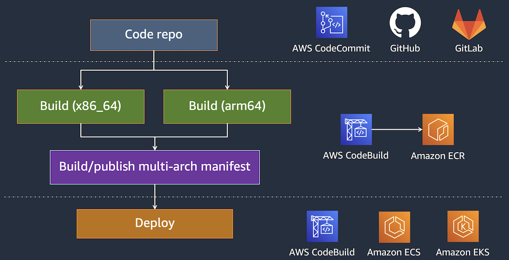

[[English](README.md)] [[한국어](README.ko.md)]

# EKS Bluprint
This is EKS Blueprint example helps you compose complete EKS clusters that are fully bootstrapped with the operational software that is needed to deploy and operate workloads. With this EKS Blueprint example, you describe the configuration for the desired state of your EKS environment, such as the control plane, worker nodes, and Kubernetes add-ons, as an Infrastructure as Code (IaC) template/blueprint. Once a blueprint is configured, you can use it to stamp out consistent environments across multiple AWS accounts and Regions using your automation workflow tool, such as Jenkins, CodePipeline. Also, you can use EKS Blueprint to easily bootstrap an EKS cluster with Amazon EKS add-ons as well as a wide range of popular open-source add-ons, including Prometheus, Karpenter, Nginx, Traefik, AWS Load Balancer Controller, Fluent Bit, Keda, ArgoCD, and more. EKS Blueprints also helps you implement relevant security controls needed to operate workloads from multiple teams in the same cluster.

## Setup
### Download
Download this example on your workspace
```
git clone https://github.com/Young-ook/terraform-aws-eks
cd terraform-aws-eks/examples/blueprint
```

Then you are in **blueprint** directory under your current workspace. There is an exmaple that shows how to use terraform configurations to create and manage an EKS cluster and Addon utilities on your AWS account. Check out and apply it using terraform command. If you don't have the terraform and kubernetes tools in your environment, go to the main [page](https://github.com/Young-ook/terraform-aws-eks) of this repository and follow the installation instructions before you move to the next step.

Run terraform:
```
terraform init
terraform apply
```
Also you can use the *-var-file* option for customized paramters when you run the terraform plan/apply command.
```
terraform plan -var-file fixture.tc1.tfvars
terraform apply -var-file fixture.tc1.tfvars
```

### Update kubeconfig
We need to get kubernetes config file for access the cluster that we've made using terraform. After terraform apply, you will see the bash command on the outputs. For more details, please refer to the [user guide](https://github.com/Young-ook/terraform-aws-eks#generate-kubernetes-config). 

## Kubernetes Controllers
### AWS App Mesh Controller
[AWS App Mesh](https://aws.amazon.com/app-mesh/) is a service mesh that provides application-level networking to make it easy for your services to communicate with each other across multiple types of compute infrastructure. App Mesh gives end-to-end visibility and high-availability for your applications.

#### Verify your App Mesh Controller
After all steps are finished, check all pods are *Ready* in *kube-system* namespace by default or you've changed. Ensure the *appmesh-controller* pod is generated and running:
```
kubectl -n kube-system get po
```
The expected output is as follows:
```
NAME                                            READY   STATUS    RESTARTS   AGE
pod/appmesh-controller-xxxxxxxxx-xxxxx          1/1     Running   0          10h
```

And you can list the all CRD(Custom Resource Definition)s for App Mesh integration.
```
kubectl get crds | grep appmesh
```

The expected output is as follows:
```
gatewayroutes.appmesh.k8s.aws
meshes.appmesh.k8s.aws
virtualgateways.appmesh.k8s.aws
virtualnodes.appmesh.k8s.aws
virtualrouters.appmesh.k8s.aws
virtualservices.appmesh.k8s.aws
```

### AWS Load Balancer Controller
AWS Load Balancer Controller is a controller to help manage Elastic Load Balancers for a Kubernetes cluster.
- It satisfies Kubernetes Ingress resources by provisioning Application Load Balancers.
- It satisfies Kubernetes Service resources by provisioning Network Load Balancers.

You can load balance application traffic across pods using the AWS Application Load Balancer (ALB). To learn more, see [What is an Application Load Balancer?](https://docs.aws.amazon.com/elasticloadbalancing/latest/application/introduction.html) in the Application Load Balancers User Guide. You can share an ALB across multiple applications in your Kubernetes cluster using Ingress groups. In the past, you needed to use a separate ALB for each application. The controller automatically provisions AWS ALBs in response to Kubernetes Ingress objects. ALBs can be used with pods deployed to nodes or to AWS Fargate. You can deploy an ALB to public or private subnets.

The [AWS load balancer controller](https://github.com/kubernetes-sigs/aws-load-balancer-controller) (formerly named AWS ALB Ingress Controller) creates ALBs and the necessary supporting AWS resources whenever a Kubernetes Ingress resource is created on the cluster with the kubernetes.io/ingress.class: alb annotation. The Ingress resource configures the ALB to route HTTP or HTTPS traffic to different pods within the cluster. To ensure that your Ingress objects use the AWS load balancer controller, add the following annotation to your Kubernetes Ingress specification. For more information, see [Ingress specification](https://kubernetes-sigs.github.io/aws-load-balancer-controller/guide/ingress/spec/) on GitHub.

The AWS Load Balancer Controller makes it easy for users to take advantage of the loadbalancer management. For more details, please visit [this](https://github.com/kubernetes-sigs/aws-load-balancer-controller)

#### Verify your AWS Load Balancer Controller
All steps are finished, check that there are pods that are *Ready* in *kube-system* namespace. Ensure the *aws-load-balancer-controller* pod is generated and running:

```
kubectl get deploy -n kube-system aws-load-balancer-controller
```

If the pod is not healthy, please try to check in the log:
```
kubectl -n kube-system logs aws-load-balancer-controller-7dd4ff8cb-wqq58
```

### Amazon CloudWatch Container Insights
[Amazon CloudWatch](https://aws.amazon.com/cloudwatch/) is a service that observes and monitors resources and applications on AWS, on premises, and on other clouds. Amazon CloudWatch collects and visualizes real-time logs, metrics, and event data in automated dashboards to streamline your infrastructure and application maintenance. CloudWatch automatically collects metrics for many resources, such as CPU, memory, disk, and network.

Use [Amazon CloudWatch Container Insights](https://docs.aws.amazon.com/AmazonCloudWatch/latest/monitoring/ContainerInsights.html) to collect, aggregate, and summarize metrics and logs from your containerized applications and microservices. Container Insights is available for Amazon Elastic Container Service (Amazon ECS), Amazon Elastic Kubernetes Service (Amazon EKS), and Kubernetes platforms on Amazon EC2. Amazon ECS support includes support for Fargate. Container Insights also provides diagnostic information, such as container restart failures, to help you isolate issues and resolve them quickly. You can also set CloudWatch alarms on metrics that Container Insights collects.


#### Verify your CloudWatch and FluentBit agents
All steps are finished, check that there are pods that are *Ready* in *kube-system* namespace. Ensure the *aws-cloudwatch-metrics*, *aws-for-fluent-bit* pods are generated and running.

### AWS Node Termination Handler
[AWS Node Termination Handler](https://github.com/aws/aws-node-termination-handler) is a project ensures that the Kubernetes control plane responds appropriately to events that can cause your EC2 instance to become unavailable, such as EC2 maintenance events, EC2 Spot interruptions, ASG Scale-In, ASG AZ Rebalance, and EC2 Instance Termination via the API or Console. The AWS Node Termination Handler provides a connection between termination requests from AWS to Kubernetes nodes, allowing graceful draining and termination of nodes that receive interruption notifications. The termination handler uses the Kubernetes API to initiate drain and cordon actions on a node that is targeted for termination. To learn more or get started, visit the project on GitHub.

#### Verify your Node Termination Handler
All steps are finished, check that the pod is *Ready* in *kube-system* namespace. Ensure the *aws-node-termination-hander* pod is running:
```
kubectl -n kube-system get po
```
```
NAME                                          READY   STATUS    RESTARTS   AGE
aws-node-xxxxx                                1/1     Running   0          19h
aws-node-termination-handler-xxxxx            1/1     Running   0          19h
coredns-xxxxxxxxx-xxxxx                       1/1     Running   0          19h
coredns-xxxxxxxxx-xxxxx                       1/1     Running   0          19h
kube-proxy-xxxxx                              1/1     Running   0          19h
metrics-server-xxxxxxxxx-xxxxx                1/1     Running   0          19h
```

And also, you can see the logs from pod to check it is working well:
```
kubectl -n kube-system logs -f aws-node-termination-handler-xxxxx
```
```
2021/01/17 08:14:11 ??? Trying to get token from IMDSv2
2021/01/17 08:14:11 ??? Got token from IMDSv2
2021/01/17 08:14:11 ??? Startup Metadata Retrieved metadata={"accountId":"xxxxxxxxxxxx","availabilityZone":"ap-northeast-2c","instanceId":"i-0dd84c15xxxxe411c","instanceType":"t3.large","localHostname":"ip-172-31-xxx-xxx.ap-northeast-2.compute.internal","privateIp":"172.31.xxx.xxx","publicHostname":"ec2-13-xxx-xxx-xxx.ap-northeast-2.compute.amazonaws.com","publicIp":"13.xxx.xxx.xxx","region":"ap-northeast-2"}
2021/01/17 08:14:11 ??? aws-node-termination-handler arguments:
	dry-run: false,
	node-name: ip-172-31-xxx-xxx.ap-northeast-2.compute.internal,
	metadata-url: http://169.254.169.254,
	kubernetes-service-host: 10.xxx.xxx.xxx,
	kubernetes-service-port: 443,
	delete-local-data: true,
	ignore-daemon-sets: true,
	pod-termination-grace-period: -1,
	node-termination-grace-period: 120,
	enable-scheduled-event-draining: false,
     <...>
	queue-url: ,
	check-asg-tag-before-draining: true,
	managed-asg-tag: aws-node-termination-handler/managed,
	aws-endpoint: ,

2021/01/17 08:14:11 ??? Started watching for interruption events
2021/01/17 08:14:11 ??? Kubernetes AWS Node Termination Handler has started successfully!
2021/01/17 08:14:11 ??? Started watching for event cancellations
2021/01/17 08:14:11 ??? Started monitoring for events event_type=SPOT_ITN
2021/01/17 09:13:59 ??? Trying to get token from IMDSv2
2021/01/17 09:13:59 ??? Got token from IMDSv2
```

### Cluster Autoscaler
[Cluster Autoscaler](https://github.com/kubernetes/autoscaler/tree/master/cluster-autoscaler) is a tool that automatically adjusts the size of a Kubernetes Cluster so that all pods have a place to run and there are no unneeded nodes when one of the following conditions is true:
* there are pods that failed to run in the cluster due to insufficient resources.
* there are nodes in the cluster that have been underutilized for an extended period of time and their pods can be placed on other existing nodes.
On AWS, Cluster Autoscaler utilizes Amazon EC2 Auto Scaling Groups to manage node groups. Cluster Autoscaler typically runs as a *Deployment* in your cluster. For more details, please check out [Cluster Autoscaler](https://docs.aws.amazon.com/eks/latest/userguide/cluster-autoscaler.html)


#### Verify your Cluster Autoscaler
All steps are finished, check that there are pods that are *Ready* in *kube-system* namespace:
Ensure the *cluster-autoscaler* pod is generated and running:

```
kubectl -n kube-system get po
```
```
NAME                                                   READY   STATUS    RESTARTS   AGE
aws-node-g4mh5                                         1/1     Running   0          10m
cluster-autoscaler-xxxxxxxxx-mwjzk                     1/1     Running   0          10m
kube-proxy-q79tk                                       1/1     Running   0          10m
```
If the pod is not healthy, please try to check the log:
```
kubectl -n kube-system logs cluster-autoscaler-xxxxxxxxx-mwjzk
```

If you want to make sure that the EC2 autoscaling group(ASG) has the tags that cluster autoscaler is looking for, you can see the latest update of cluster autoscaler. It may look like below. You can check whether cluster autoscaler is able to recognize the ASG. If cluster autoscaler is able to recognize the ASG, you will see the ASG name under NodeGroups section. If you don't even see NodeGroups section, it means that cluster autoscaler is still not able to autodiscover your ASG.
```
kubectl -n kube-system get cm cluster-autoscaler-status -o yaml
```
```
apiVersion: v1
data:
  status: |+
    Cluster-autoscaler status at 2021-01-08 04:04:55.644106199 +0000 UTC:
    NodeGroups:
      Name:        eks-xxxxyyyy-c03a-xxxx-1111-2dc09d308552
      Health:      Healthy (ready=2 unready=0 notStarted=0 longNotStarted=0 registered=2 longUnregistered=0 cloudProviderTarget=2 (minSize=1, maxSize=3))
                   LastProbeTime:      2021-01-08 04:04:55.643676127 +0000 UTC m=+6684.061091143
                   LastTransitionTime: 2021-01-08 02:14:17.530198588 +0000 UTC m=+45.947613652
```

Then, you can use [*nginx*](./apps/README.md#nginx) to test Cluster Autoscaling(CA) and Horizonal Pod Autoscaling(HPA).

## Kubernetes Utilities
### Chaos Mesh
[Chaos Mesh](https://chaos-mesh.org/docs/) is an open source cloud-native Chaos Engineering platform. It offers various types of fault simulation and has an enormous capability to orchestrate fault scenarios. Using Chaos Mesh, you can conveniently simulate various abnormalities that might occur in reality during the development, testing, and production environments and find potential problems in the system. To lower the threshold for a Chaos Engineering project, Chaos Mesh provides you with a visualization operation. You can easily design your Chaos scenarios on the Web UI and monitor the status of Chaos experiments.

You can install chaos mesh on your kubernetes cluster by helm which is a clustered application package manager. Simply add your helm chart configuration into addons list variable in *helm-addons* module. And apply terraform configuration changes. Here is an example.
```
module "helm-addons" {
  source     = "Young-ook/eks/aws//modules/helm-addons"
  tags       = var.tags
  addons = [
    {
      repository      = "https://charts.chaos-mesh.org"
      name            = "chaos-mesh"
      chart_name      = "chaos-mesh"
      namespace       = "chaos-mesh"
      serviceaccount  = "chaos-mesh-controller"
    },
  ]
}
```

All steps to install chaos mesh using helm-addons are finished, check if all pods are *Ready* in *chaos-mesh* namespace by default or you've changed. To check the running status of Chaos Mesh, execute the following command:

```
kubectl -n chaos-mesh get po
```
The expected output is as follows:
```
NAME                                        READY   STATUS    RESTARTS   AGE
chaos-controller-manager-69fd5c46c8-xlqpc   3/3     Running   0          2d5h
chaos-daemon-jb8xh                          1/1     Running   0          2d5h
chaos-dashboard-98c4c5f97-tx5ds             1/1     Running   0          2d5h
```

### Metrics Server
[Metrics Server](https://github.com/kubernetes-sigs/metrics-server) is a scalable, efficient source of container resource metrics for Kubernetes built-in autoscaling pipelines. Metrics Server collects resource metrics from Kubelets and exposes them in Kubernetes apiserver through [Metrics API](https://github.com/kubernetes/metrics) for use by Horizontal Pod Autoscaler and Vertical Pod Autoscaler. Metrics API can also be accessed by kubectl top, making it easier to debug autoscaling pipelines.

### Prometheus
[Prometheus](https://prometheus.io/) is an open-source systems monitoring and alerting toolkit originally built at SoundCloud. Since its inception in 2012, many companies and organizations have adopted Prometheus, and the project has a very active developer and user community. It is now a standalone open source project and maintained independently of any company. Prometheus joined the Cloud Native Computing Foundation in 2016 as the second hosted project, after Kubernetes.

You can install prometheus on your kubernetes cluster by helm which is a clustered application package manager. Simply add your helm chart configuration into addons list variable in *helm-addons* module. And apply terraform configuration changes to install prometheus monitoring tool. Here is an example.
```
module "helm-addons" {
  source     = "Young-ook/eks/aws//modules/helm-addons"
  tags       = var.tags
  addons = [
    {
      repository     = "https://prometheus-community.github.io/helm-charts"
      name           = "prometheus"
      chart_name     = "prometheus"
      namespace      = "prometheus"
      serviceaccount = "prometheus"
      values = {
        "alertmanager.persistentVolume.storageClass" = "gp2"
        "server.persistentVolume.storageClass"       = "gp2"
      }
    },
  ]
}
```

## Computing options
### AWS Fargate (Serverless)
AWS Fargate is a technology that provides on-demand, right-sized compute capacity for containers. With AWS Fargate, you no longer have to provision, configure, or scale groups of virtual machines to run containers. This removes the need to choose server types, decide when to scale your node groups, or optimize cluster packing. You can control which pods start on Fargate and how they run with Fargate profiles. Each pod running on Fargate has its own isolation boundary and does not share the underlying kernel, CPU resources, memory resources, or elastic network interface with another pod. For more information, please refer [this](https://docs.aws.amazon.com/eks/latest/userguide/fargate.html).

To run an example of serverless node groups with AWS Fargate, use the another fixture template that configures to only use AWS Fargate based instances. Edit main.tf file to remove all helm-addons except *aws-load-balancer-controller*, *metrics-server* from the map of helm-addons. And remove all eks-addons except *vpc-cni* and save the file. If you don't remove it, you will get an error that the terraform configuration can't get the instance profile data from the output of the eks module. Run terraform command with fargate fixtures:
```
terraform apply -var-file fixture.fargate.tfvars
```

Then, you can deploy an example from publie resource, such as [*hello-kuberntes*](https://github.com/paulbouwer/hello-kubernetes), [*nginx*](https://kubernetes.io/docs/concepts/workloads/controllers/deployment/).
For example, you can check the list of currently running farget nodes after deployment. Run kubernetes cli:
```
kubectl get no
```
```
NAME                 STATUS   ROLES    AGE     VERSION
fargate-10.0.2.59    Ready    <none>   109s    v1.17.9-eks-a84824
fargate-10.0.3.171   Ready    <none>   2m31s   v1.17.9-eks-a84824
fargate-10.0.3.80    Ready    <none>   2m49s   v1.17.9-eks-a84824
```

### AWS Graviton (Multi-Arch)
[AWS Graviton](https://aws.amazon.com/ec2/graviton/) processors are custom built by Amazon Web Services using 64-bit ARM Neoverse cores to deliver the best price performance for you cloud workloads running on Amazon EC2. The new general purpose (M6g), compute-optimized (C6g), and memory-optimized (R6g) instances deliver up to 40% better price/performance over comparable current generation x86-based instances for scale-out and Arm-based applications such as web servers, containerized microservices, caching fleets, and distributed data stores that are supported by the extensive Arm ecosystem. You can mix x86 and Arm based EC2 instances within a cluster, and easily evaluate Arm-based application in existing environments. Here is a useful [getting started](https://github.com/aws/aws-graviton-getting-started) guide on how to start to use AWS Graviton. This github repository would be good point where to start. You can find out more details about how to build, run and optimize your application for AWS Graviton processors.

To run an example of hybrid-architecture node groups with AWS Graviton, use the another fixture template that configures to only use AWS Graviton based instances. This stap will create both ARM64 and AMD64 architecture based instances for hybrid archtecture computing example.
```
terraform apply -var-file fixture.graviton.tfvars
```

#### CodeBuild Environment
To build an application for ARM64 architecture with AWS CodeBuild, we have to configure environment variable of the build project. The key parameters of the environment for build project are *image*, *type* and *compute type*. The image parameter is (container) image tag or image digest that identifies the Docker image to use for this build project. We use *aws/codebuild/amazonlinux2-aarch64-standard:2.0* image to build an application for ARM64 architectuer based. The type of build environment to use for related builds. In this example, *ARM_CONTAINER* is suitalbe. Be aware of that the environment type *ARM_CONTAINER* is available only in regions US East (N. Virginia), US East (Ohio), US West (Oregon), EU (Ireland), Asia Pacific (Mumbai), Asia Pacific (Tokyo), Asia Pacific (Sydney), and EU (Frankfurt). For more information about build project enviroment, please refer to [this user guide](https://docs.aws.amazon.com/AWSCloudFormation/latest/UserGuide/aws-properties-codebuild-project-environment.html)
There is another important configuration for build project. We have to set compute type to *BUILD_GENERAL1_LARGE* type. Currently it is only available for *ARM_CONTAINER* environment type of CodeBuild project. Please visit [this page](https://docs.aws.amazon.com/codebuild/latest/userguide/build-env-ref-compute-types.html) to find out more information and for latest updates.



#### Verify Graviton instances
After provisioning of EKS cluster, you can describe nodes using kubectl and check out your node groups are running on ARM64 architecture. Amazon EKS customers can now run production workloads using Arm-based instances including the recently launched Amazon EC2 M6g, C6g, and R6g instances powered by AWS Graviton2 processors. Create an EKS cluster with a mixed architecture based node groups.
```
kubectl describe node
```
```
System Info:
  OS Image:                   Amazon Linux 2
  Operating System:           linux
  Architecture:               arm64
  Container Runtime Version:  docker://19.3.6
  Kubelet Version:            v1.17.11-eks-xxxxyy
  Kube-Proxy Version:         v1.17.11-eks-xxxxyy
```

### Amazon EC2 Spot Instances
Amazon EC2 Spot Instances let you take advantage of unused EC2 capacity in the AWS cloud. Spot Instances are available at up to a 90% discount compared to On-Demand prices; however, can be interrupted via Spot Instance interruptions, a two-minute warning before Amazon EC2 stops or terminates the instance. The AWS Node Termination Handler makes it easy for users to take advantage of the cost savings and performance boost offered by EC2 Spot Instances in their Kubernetes clusters while gracefully handling EC2 Spot Instance terminations. The AWS Node Termination Handler provides a connection between termination requests from AWS to Kubernetes nodes, allowing graceful draining and termination of nodes that receive interruption notifications. The termination handler uses the Kubernetes API to initiate drain and cordon actions on a node that is targeted for termination. For more details, please visit [this](https://github.com/Young-ook/terraform-aws-eks/tree/main/modules/node-termination-handler/)

### Bottle Rocket OS
[Bottlerocket](https://github.com/bottlerocket-os/bottlerocket) is a free and open-source Linux-based operating system meant for hosting containers. If you’re ready to jump right in, read one of our setup guides for running Bottlerocket in Amazon EKS, Amazon ECS, or VMware. Bottlerocket focuses on security and maintainability, providing a reliable, consistent, and safe platform for container-based workloads. This is a reflection of what we've learned building operating systems and services at Amazon. The base operating system has just what you need to run containers reliably, and is built with standard open-source components. Bottlerocket-specific additions focus on reliable updates and on the API. Instead of making configuration changes manually, you can change settings with an API call, and these changes are automatically migrated through updates.


In this EKS blueprint, you can configure an AMI type for your (aws managed or self managed) node groups. For GPU instance types, you can set the *ami_type* parameter in the node group definition. GPU instance types should use the AL2_x86_64_GPU for its ami type or Non-GPU instances should use the AL2_x86_64. And ARM architecture based instance should use AL2_ARM_64.

Possible values:
- AL2_x86_64
- AL2_x86_64_GPU
- AL2_ARM_64
- CUSTOM
- BOTTLEROCKET_ARM_64
- BOTTLEROCKET_x86_64

## Applications
- [Yelb](./apps/README.md#yelb)
- [Game 2048](./apps/README.md#game-2048)
- [Nginx](./apps/README.md#nginx)
- [Hello NodeJS](./apps/README.md#hello-nodejs)
- [Hello Kuberentes](./apps/README.md#hello-kubernetes)
- [Podinfo](https://github.com/stefanprodan/podinfo)

## Clean up
To destroy all infrastrcuture, run terraform:
```
terraform destroy
```

If you don't want to see a confirmation question, you can use quite option for terraform destroy command
```
terraform destroy --auto-approve
```

**[DON'T FORGET]** You have to use the *-var-file* option when you run terraform destroy command to delete the aws resources created with extra variable files.
```
terraform destroy -var-file fixture.tc1.tfvars
```

# Additional Resources
## AWS AppMesh
- [Learning AWS App Mesh](https://aws.amazon.com/blogs/compute/learning-aws-app-mesh/)
- [AWS App Mesh Examples](https://github.com/aws/aws-app-mesh-examples)
- [Getting started with AWS App Mesh and Amazon EKS](https://aws.amazon.com/blogs/containers/getting-started-with-app-mesh-and-eks/)

## AWS Load Balancer Controller
- [Kubernetes Ingress with AWS ALB Ingress Controller](https://aws.amazon.com/blogs/opensource/kubernetes-ingress-aws-alb-ingress-controller/a)
- [AWS Load Balancer Controller](https://github.com/kubernetes-sigs/aws-load-balancer-controller)

## Amazon CloudWatch Container Insights
- [Amazon CloudWatch Container Insights for Amazon ECS](https://aws.amazon.com/blogs/mt/introducing-container-insights-for-amazon-ecs)

## Amazon EKS Add-ons
- [Metrics and traces collection using Amazon EKS add-ons for AWS Distro for OpenTelemetry (ADOT)](https://aws.amazon.com/blogs/containers/metrics-and-traces-collection-using-amazon-eks-add-ons-for-aws-distro-for-opentelemetry/)

## AWS Graviton
- [Amazon's Arm-based Graviton2 Against AMD and Intel](https://www.anandtech.com/show/15578/cloud-clash-amazon-graviton2-arm-against-intel-and-amd)
- [Graviton2 Single Threaded Performance](https://www.anandtech.com/show/15578/cloud-clash-amazon-graviton2-arm-against-intel-and-amd/5)

## Chaos Mesh
- [Simulate Kubernetes Resource Stress Test](https://chaos-mesh.org/docs/simulate-heavy-stress-on-kubernetes/) 
- [Simulate AWS Faults](https://chaos-mesh.org/docs/simulate-aws-chaos/)

## Cluster Autoscaler
- [Autoscaling](https://docs.aws.amazon.com/eks/latest/userguide/autoscaling.html)

## IAM Role for Service Accounts
- [Diving into IAM Roles for Service Accounts](https://aws.amazon.com/blogs/containers/diving-into-iam-roles-for-service-accounts/)

## Karpenter
- [Introducing Karpenter](https://aws.amazon.com/blogs/aws/introducing-karpenter-an-open-source-high-performance-kubernetes-cluster-autoscaler/)
- [Implement autoscaling with Karpenter](https://www.eksworkshop.com/beginner/085_scaling_karpenter/)

## Prometheus
- [Deploy Promethus using Helm](https://www.eksworkshop.com/intermediate/240_monitoring/deploy-prometheus/)
