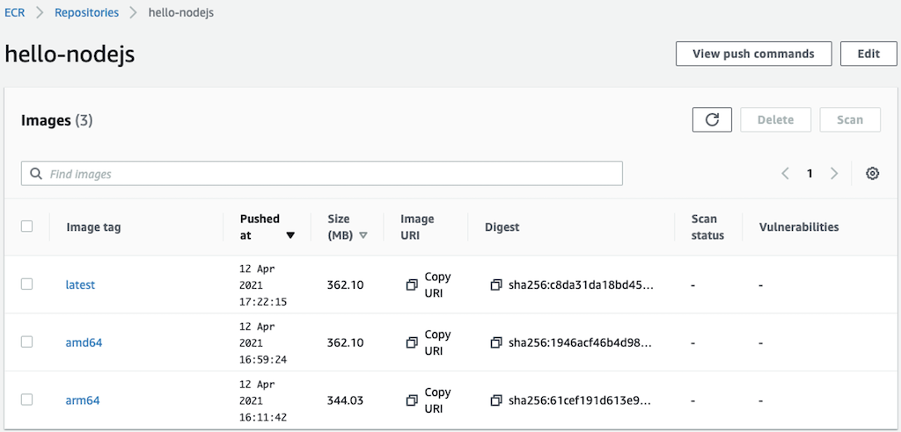

[[English](README.md)] [[한국어](README.ko.md)]

# Applications
## Yelb
Yelb is an example of simple restaurant voting app using Amazon EKS and AWS App Mesh. All application computing and data storage resources are deployed on a private network. And an App Mesh proxy (also known as a sidecar proxy in Service Mesh) is also deployed alongside the application container. And AWS X-ray is a tracing system for observing the communication topology of complex distributed systems. Here is the architecture.


### Deploy a service mesh example
Run kubectl from the workspace where you ran terraform:
```
kubectl apply -f yelb.yaml
```

### Access the example
#### Local Workspace
In your local workspace, connect through a proxy to access your application's endpoint.
```
kubectl -n yelb port-forward svc/yelb-ui 8080:80
```
Open `http://localhost:8080` on your web browser. This shows the application main page.

#### Cloud9
In your Cloud9 IDE, run the application.
```
kubectl -n yelb port-forward svc/yelb-ui 8080:80
```

Click **Preview** and **Preview Running Application**. This opens up a preview tab and shows the application main page.


### Delete the application
Run kubectl:
```
kubectl delete -f yelb.yaml
```

## Game 2048
You can run the sample application on a cluster. Deploy the game 2048 as a sample application to verify that the AWS load balancer controller creates an AWS ALB as a result of the Ingress object.
```
kubectl apply -f https://raw.githubusercontent.com/kubernetes-sigs/aws-load-balancer-controller/main/docs/examples/2048/2048_full.yaml
```

After a few minutes, verify that the Ingress resource was created with the following command. Describe ingress resource using kubectl. You will see the amazon resource name (ARN) of the generated application load balancer (ALB). Copy the address from output and open on the web browser.
```
kubectl -n game-2048 get ing
```

Output:
```
NAME           CLASS    HOSTS   ADDRESS                                                                        PORTS   AGE
ingress-2048   <none>   *       k8s-game2048-ingress2-9e5ab32c61-1003956951.ap-northeast-2.elb.amazonaws.com   80      29s
```


### Delete the application
Run kubectl:
```
kubectl delete -f https://raw.githubusercontent.com/kubernetes-sigs/aws-load-balancer-controller/main/docs/examples/2048/2048_full.yaml
```

## Nginx
### Deploy Nginx from Public Registry
Copy below and **SAVE** as a new deployment file (nginx.yaml) on your workspace. You can edit the file if you have anything to change.
```
apiVersion: v1
kind: Service
metadata:
  name: my-nginx-svc
  labels:
    app: nginx
spec:
  ports:
  - port: 80
  selector:
    app: nginx
---
apiVersion: apps/v1
kind: Deployment
metadata:
  name: my-nginx
  labels:
    app: nginx
spec:
  replicas: 3
  selector:
    matchLabels:
      app: nginx
  template:
    metadata:
      labels:
        app: nginx
    spec:
      containers:
      - name: nginx
        image: nginx:1.14.2
        ports:
        - containerPort: 80
```
Then, apply the modified manifest.
```
kubectl apply -f nginx.yaml
```

To verify that the nginx pods are running properly on the multiple architecture node groups, run describe command.
```
kubectl describe no
```

The output will be shown below.
```
Name:               ip-172-xx-yx-xxx.us-west-2.compute.internal
                    beta.kubernetes.io/instance-type=m6g.medium
                    eks.amazonaws.com/nodegroup=eks-x86-arm64-tc2
                    kubernetes.io/arch=arm64
                    kubernetes.io/os=linux
CreationTimestamp:  Fri, 20 Nov 2020 12:52:26 +0900
System Info:
  Operating System:           linux
  Architecture:               arm64
  Container Runtime Version:  docker://19.3.6
  Kubelet Version:            v1.17.12-eks-xxxxyy
  Kube-Proxy Version:         v1.17.12-eks-xxxxyy
Non-terminated Pods:          (8 in total)
  Namespace                   Name                         CPU Requests  CPU Limits  Memory Requests  Memory Limits  AGE
  ---------                   ----                         ------------  ----------  ---------------  -------------  ---
  default                     my-nginx-xxxxyyyyww-bqpfk    0 (0%)        0 (0%)      0 (0%)           0 (0%)         3m2s
  default                     my-nginx-xxxxyyyyww-fzpfb    0 (0%)        0 (0%)      0 (0%)           0 (0%)         3m2s
  default                     my-nginx-xxxxyyyyww-kqht5    0 (0%)        0 (0%)      0 (0%)           0 (0%)         3m2s
  default                     my-nginx-xxxxyyyyww-m5x25    0 (0%)        0 (0%)      0 (0%)           0 (0%)         3m2s
  default                     my-nginx-xxxxyyyyww-tcv92    0 (0%)        0 (0%)      0 (0%)           0 (0%)         3m2s
Events:                       <none>
Name:               ip-172-xx-yy-xxx.us-west-2.compute.internal
                    beta.kubernetes.io/instance-type=m5.large
                    eks.amazonaws.com/nodegroup=eks-x86-arm64-tc2
                    kubernetes.io/arch=amd64
                    kubernetes.io/os=linux
CreationTimestamp:  Fri, 20 Nov 2020 12:52:59 +0900
System Info:
  Operating System:           linux
  Architecture:               amd64
  Container Runtime Version:  docker://19.3.6
  Kubelet Version:            v1.17.12-eks-xxxxyy
  Kube-Proxy Version:         v1.17.12-eks-xxxxyy
Non-terminated Pods:          (28 in total)
  Namespace                   Name                         CPU Requests  CPU Limits  Memory Requests  Memory Limits  AGE
  ---------                   ----                         ------------  ----------  ---------------  -------------  ---
  default                     my-nginx-xxxxyyyyww-5wlvd    0 (0%)        0 (0%)      0 (0%)           0 (0%)         3m2s
  default                     my-nginx-xxxxyyyyww-626nn    0 (0%)        0 (0%)      0 (0%)           0 (0%)         3m2s
  default                     my-nginx-xxxxyyyyww-6h7nk    0 (0%)        0 (0%)      0 (0%)           0 (0%)         3m2s
  default                     my-nginx-xxxxyyyyww-dgppf    0 (0%)        0 (0%)      0 (0%)           0 (0%)         3m2s
  default                     my-nginx-xxxxyyyyww-fgp8r    0 (0%)        0 (0%)      0 (0%)           0 (0%)         3m2s
Events:                       <none>
```

### Delete the application
Run kubectl:
```
kubectl delete -f nginx.yaml
```

## Hello NodeJS
This is a simple example of multi-arch application.

### Build multi-arch container images using CodeBuild
Move to the CodeBuild service page on the Amazon Console. And start to run build projects that has *hellojs* in their project name. After then, you will see the generated container images for multiple architecture (amd64/x86_64, arm64/aarch64) and integrated manifest.


### Deploy NodeJS application from Private Registry
If there is no error message, you can go to deploy the artifact from build project. Apply the manifest to deploy hello nodejs application with the multi-arch container images that had been just baked.
```
kubectl apply -f hellojs.yaml
```

### Delete the application
Run kubectl:
```
kubectl delete -f hellojs.yaml
```

# Known Issues
## Dependency Violation
Make sure the game 2048 application is removed from the kubernetes cluster before deploying the infrastructure. If you skipped uninstalling the 2048 game in the previous step, you may see an error like the one below because terraform did not delete the application load balancer it created using the load balancer controller.
```
 Error: error deleting EC2 Subnet (subnet-001c9360b531a4a70): DependencyViolation: The subnet 'subnet-001c9360b531a4a70' has dependencies and cannot be deleted.
│ 	status code: 400, request id: f76a5dc7-0107-4847-a006-4c4e46be9720
╵
```

## Empty Exception
Make sure to clean up all ECR repository while you run EKS blueprint example before you destroy all infrastructure. If you skipped a task to delete the existing repositories in this workshop, you may see an error like the one below because terraform did not delete the not empty ECR repository.
```
╷
│ Error: ECR Repository (hellojs) not empty, consider using force_delete: RepositoryNotEmptyException: The repository with name 'hellojs' in registry with id '171104014478' cannot be deleted because it still contains images
│
│
```
