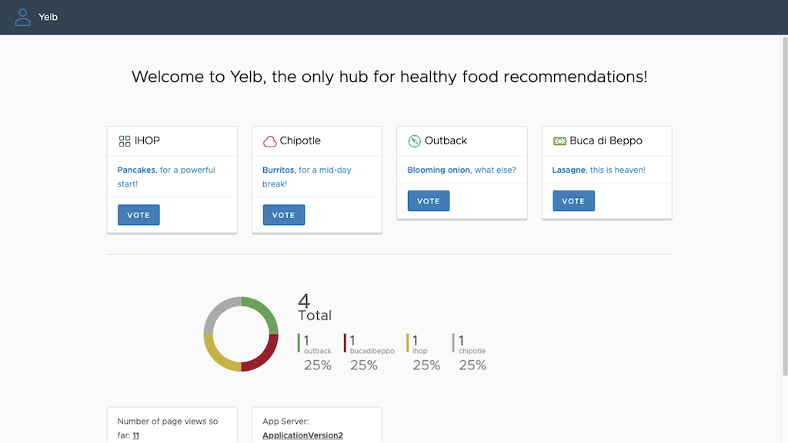

[[English](README.md)] [[한국어](README.ko.md)]

# Applications
## Yelb
Yelb is an example of simple restaurant voting app using Amazon EKS and AWS App Mesh. All application computing and data storage resources are deployed on a private network. And an App Mesh proxy (also known as a sidecar proxy in Service Mesh) is also deployed alongside the application container. And AWS X-ray is a tracing system for observing the communication topology of complex distributed systems. Here is the architecture.


### Deploy a service mesh example
Run kubectl from the workspace where you ran terraform:
```
kubectl apply -f apps/yelb/yelb.yaml
```

### Access the example
#### Local Workspace
In your local workspace, connect through a proxy to access your application's endpoint.
```
kubectl -n yelb port-forward svc/yelb-ui 8080:80
```
Open `http://localhost:8080` on your web browser. This shows the application main page.

#### Cloud9
In your Cloud9 IDE, run the application.
```
kubectl -n yelb port-forward svc/yelb-ui 8080:80
```

Click **Preview** and **Preview Running Application**. This opens up a preview tab and shows the application main page.


### Delete the application
Run kubectl:
```
kubectl delete -f apps/yelb/yelb.yaml
```

## Game 2048
You can run the sample application on a cluster. Deploy the game 2048 as a sample application to verify that the AWS load balancer controller creates an AWS ALB as a result of the Ingress object.
```
kubectl apply -f https://raw.githubusercontent.com/kubernetes-sigs/aws-load-balancer-controller/main/docs/examples/2048/2048_full.yaml
```

After a few minutes, verify that the Ingress resource was created with the following command. Describe ingress resource using kubectl. You will see the amazon resource name (ARN) of the generated application load balancer (ALB). Copy the address from output (e.g., k8s-game2048-ingress2-9e5ab32c61-1003956951.ap-northeast-2.elb.amazonaws.com) and open on the web browser.
```
kubectl -n game-2048 get ing
```

Output:
```
NAME           CLASS    HOSTS   ADDRESS                                                                        PORTS   AGE
ingress-2048   <none>   *       k8s-game2048-ingress2-9e5ab32c61-1003956951.ap-northeast-2.elb.amazonaws.com   80      29s
```


### Delete the application
Run kubectl:
```
kubectl delete -f https://raw.githubusercontent.com/kubernetes-sigs/aws-load-balancer-controller/main/docs/examples/2048/2048_full.yaml
```

## Hello NodeJS
This is a simple example of multi-arch application.

### Build multi-arch container images using CodeBuild
Move to the CodeBuild service page on the Amazon Console. And start to run build projects that has *hellojs* in their project name. After then, you will see the generated container images for multiple architecture (amd64/x86_64, arm64/aarch64) and integrated manifest.


### Deploy NodeJS application from Private Registry
If there is no error message, you can go to deploy the artifact from build project. Apply the manifest to deploy hello nodejs application with the multi-arch container images that had been just baked.
```
kubectl apply -f hellojs.yaml
```

### Delete the application
Run kubectl:
```
kubectl delete -f hellojs.yaml
```

## Hello Kubernetes
### Deploy Hello Kubernetes application
This is a simple example to show kubernetes information. Copy below and **SAVE** as a new deployment file (hellokube.yaml) on your workspace. You can edit the file if you have anything to change.
```
apiVersion: v1
kind: Service
metadata:
  name: hello-kubernetes
spec:
  ports:
  - port: 80
    targetPort: 8080
  selector:
    app: hello-kubernetes
---
apiVersion: apps/v1
kind: Deployment
metadata:
  name: hello-kubernetes
spec:
  replicas: 3
  selector:
    matchLabels:
      app: hello-kubernetes
  template:
    metadata:
      labels:
        app: hello-kubernetes
    spec:
      containers:
      - name: hello-kubernetes
        image: paulbouwer/hello-kubernetes:1.8
        ports:
        - containerPort: 8080
```
Then, apply the modified manifest.
```
kubectl apply -f hellokube.yaml
```

To check the status of node groups, run kubernetes cli command:
```
kubectl get no
```
```
NAME                 STATUS   ROLES    AGE     VERSION
fargate-10.0.2.59    Ready    <none>   109s    v1.17.9-eks-a84824
fargate-10.0.3.171   Ready    <none>   2m31s   v1.17.9-eks-a84824
fargate-10.0.3.80    Ready    <none>   2m49s   v1.17.9-eks-a84824
```
A few minutes later you can see the fargate/ec2 nodes are up. And you can try to access the service via port forwarding when all pods are ready and runnig. If everything looks fine, go forward to the next step.

### Access the example
#### Local Workspace
In your local workspace, connect through a proxy to access your application's endpoint.
```
kubectl port-forward svc/hello-kubernetes 8080:80
```
Open `http://localhost:8080` on your web browser. This shows the application main page.

#### Cloud9
In your Cloud9 IDE, run the application.
```
kubectl port-forward svc/hello-kubernetes 8080:80
```

### Delete the application
To clean up all resources or hello-kubernetes application from cluster, run kubectl:
```
kubectl delete -f hellokube.yaml
```

## Nginx
### Deploy Nginx from Public Registry
First, we will deploy a container image and expose it as a service. Here is the details of kubernetes manifest file to deploy a simple NGINX web application and kubernetes service. The service will listen for http requests on port 80. Copy below and **SAVE** as a new deployment file (nginx.yaml) on your workspace. You can edit the file if you have anything to change.
```
apiVersion: v1
kind: Service
metadata:
  name: my-nginx-svc
  labels:
    app: nginx
spec:
  ports:
  - port: 80
  selector:
    app: nginx
---
apiVersion: apps/v1
kind: Deployment
metadata:
  name: my-nginx
  labels:
    app: nginx
spec:
  replicas: 3
  selector:
    matchLabels:
      app: nginx
  template:
    metadata:
      labels:
        app: nginx
    spec:
      containers:
      - name: nginx
        image: nginx:1.14.2
        ports:
        - containerPort: 80
        resources:
          limits:
            cpu: 500m
          requests:
            cpu: 200m
```

Then, apply the modified manifest.
```
kubectl apply -f nginx.yaml
```

To verify that the nginx pods are running properly on the multiple architecture node groups, run describe command:
```
kubectl describe no
```

The output will be shown below.
```
Name:               ip-172-xx-yx-xxx.us-west-2.compute.internal
                    beta.kubernetes.io/instance-type=m6g.medium
                    eks.amazonaws.com/nodegroup=eks-x86-arm64
                    kubernetes.io/arch=arm64
                    kubernetes.io/os=linux
CreationTimestamp:  Fri, 20 Nov 2020 12:52:26 +0900
System Info:
  Operating System:           linux
  Architecture:               arm64
  Container Runtime Version:  docker://19.3.6
  Kubelet Version:            v1.17.12-eks-xxxxyy
  Kube-Proxy Version:         v1.17.12-eks-xxxxyy
Non-terminated Pods:          (8 in total)
  Namespace                   Name                         CPU Requests  CPU Limits  Memory Requests  Memory Limits  AGE
  ---------                   ----                         ------------  ----------  ---------------  -------------  ---
  default                     my-nginx-xxxxyyyyww-bqpfk    0 (0%)        0 (0%)      0 (0%)           0 (0%)         3m2s
```

And you can see the nginx pod status using kubernetes command line tool.
```
kubectl get pod -l app=nginx
```

### Cluster Autoscaler (CA)
Before you begin make sure that any Horizontal Pod Autoscaler (HPA) is removed from your kuberentes application and the desired capacity of your EC2 autoscaling group (EKS nodes) is 1. You need to reset the configuration of nginx application using *kubectl* command (e.g., kubectl delete -f nginx.yaml) if you did something on your nginx application. This is important because you want to see that the cluster autoscaling processing is working properly to automatically increase instance capacity when there is no space to launch the reserved container.

```
kubectl scale --replicas=10 deployment/my-nginx
kubectl get po -o wide -w
```
```
NAME                          READY   STATUS    RESTARTS   AGE   IP              NODE                                               NOMINATED NODE   READINESS GATES
my-nginx-79544xxxxx-9lbhz   1/1     Running   0          41h   172.31.36.219   ip-172-31-38-165.ap-northeast-2.compute.internal   <none>           <none>
my-nginx-79544xxxxx-r64b2   1/1     Running   0          71s   172.31.32.31    ip-172-31-38-165.ap-northeast-2.compute.internal   <none>           <none>
my-nginx-79544xxxxx-ws6qw   0/1     Pending   0          71s   <none>          <none>                                             <none>           <none>
my-nginx-79544xxxxx-ws6qw   0/1     Pending   0          2m13s   <none>          <none>                                             <none>           <none>
my-nginx-79544xxxxx-ws6qw   0/1     Pending   0          2m45s   <none>          ip-172-31-54-84.ap-northeast-2.compute.internal    <none>           <none>
my-nginx-79544xxxxx-ws6qw   0/1     ContainerCreating   0          2m45s   <none>          ip-172-31-54-84.ap-northeast-2.compute.internal    <none>           <none>
my-nginx-79544xxxxx-ws6qw   1/1     Running             0          2m55s   172.31.60.13    ip-172-31-54-84.ap-northeast-2.compute.internal    <none>           <none>
```

### Horizontal Pod Autoscaler (HPA)
Now, if your nginx application is up and running, you can start to create a kuberentes Horizontal Pod Autoscaler (HPA) object on your application for application autoscaling. The following command will create a HPA that maintains between 1 and 10 replicas of the Pods controlled by the nginx deployment we created in the previous step. Edit the *nginx.yaml* to add the below code snippet and **SAVE**. Then apply the saved manifest file.
```
---
apiVersion: autoscaling/v1
kind: HorizontalPodAutoscaler
metadata:
  name: my-nginx
spec:
  scaleTargetRef:
    apiVersion: apps/v1
    kind: Deployment
    name: my-nginx
  minReplicas: 1
  maxReplicas: 10
  targetCPUUtilizationPercentage: 50
```
```
kubectl apply -f nginx.yaml
```

Alternatively, you can apply HPA directly to your application using the kubernetes command line tool. However, it is not recommended for production environments. Because manfest files are easier to manage the change history than live patches.
```
kubectl autoscale deployment my-nginx --cpu-percent=50 --min=1 --max=10
```

After a few minutes, you will see the status of autoscaler. Display the hpa status:
```
kubectl get hpa
```
```
NAME         REFERENCE                     TARGET    MINPODS   MAXPODS   REPLICAS   AGE
my-nginx     Deployment/my-nginx/scale     0% / 50%  1         10        1          18s
```

Now, it is time to see how the autoscaler reacts to increased load. You will start a container, and send an infinite loop of queries to the nginx service (please run it in a different terminal):
```
kubectl run -i --tty load-generator --rm --image=busybox --restart=Never -- /bin/sh -c "while sleep 0.01; do wget -q -O- http://my-nginx; done"
```

Within a minute or so, we should see the higher CPU load by executing:
```
kubectl get hpa
```
```
NAME         REFERENCE                     TARGET      MINPODS   MAXPODS   REPLICAS   AGE
my-nginx     Deployment/my-nginx/scale     250% / 50%  1         10        1          3m
```
Here, CPU consumption has increased to 250% of the request. As a result, the deployment was resized to 5 replicas:
```
kubectl get deploy my-nginx
```
```
NAME         READY   UP-TO-DATE   AVAILABLE   AGE
my-nginx     5/5     5            5           9m31s
```
```
kubectl get hpa
```
```
NAME         REFERENCE               TARGETS    MINPODS   MAXPODS   REPLICAS   AGE
my-nginx     Deployment/my-nginx     250%/50%   1         10        5          6m7s
```
```
kubectl get pod
```
```
NAME                          READY   STATUS    RESTARTS   AGE
my-nginx-79544xxxxx-6ph8z     1/1     Running   0          56s
my-nginx-79544xxxxx-mtbll     1/1     Running   0          56s
my-nginx-79544xxxxx-rj8hj     1/1     Running   0          41s
my-nginx-79544xxxxx-rj9p6     1/1     Running   0          6m27s
my-nginx-79544xxxxx-ts5d2     1/1     Running   0          56s
```

### Delete the application
Run kubectl:
```
kubectl delete -f nginx.yaml
```

# Known Issues
## Dependency Violation
Make sure the game 2048 application is removed from the kubernetes cluster before deploying the infrastructure. If you skipped uninstalling the 2048 game in the previous step, you may see an error like the one below because terraform did not delete the application load balancer it created using the load balancer controller.
```
 Error: error deleting EC2 Subnet (subnet-001c9360b531a4a70): DependencyViolation: The subnet 'subnet-001c9360b531a4a70' has dependencies and cannot be deleted.
│ 	status code: 400, request id: f76a5dc7-0107-4847-a006-4c4e46be9720
╵
```

## Empty Exception
Make sure to clean up all ECR repository while you run EKS blueprint example before you destroy all infrastructure. If you skipped a task to delete the existing repositories in this workshop, you may see an error like the one below because terraform did not delete the not empty ECR repository.
```
╷
│ Error: ECR Repository (hellojs) not empty, consider using force_delete: RepositoryNotEmptyException: The repository with name 'hellojs' in registry with id '171104014478' cannot be deleted because it still contains images
│
│
```
