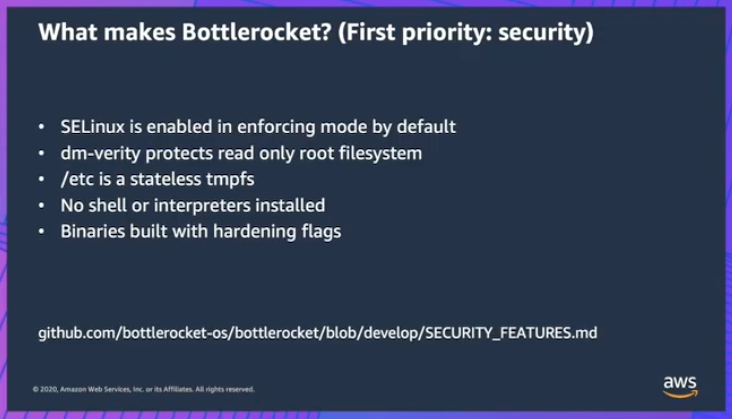
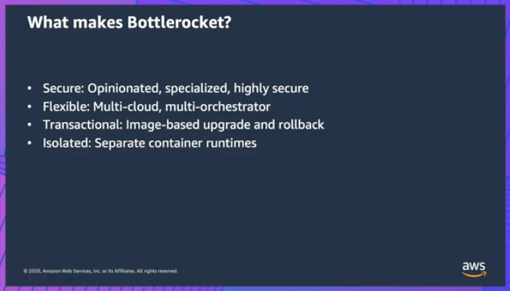

# Bottle Rocket OS




## Download example
Download this example on your workspace
```sh
git clone https://github.com/Young-ook/terraform-aws-eks
cd terraform-aws-eks/examples/bottlerocket
```

## Setup
[This](https://github.com/Young-ook/terraform-aws-eks/blob/main/examples/bottlerocket/main.tf) is the example of terraform configuration file to create a managed EKS on your AWS account. Check out and apply it using terraform command.

Run terraform:
```
terraform init
terraform apply
```
Also you can use the `-var-file` option for customized paramters when you run the terraform plan/apply command.
```
terraform plan -var-file tc1.tfvars
terraform apply -var-file tc1.tfvars
```

## Launch Bottlerocket managed node group
You can configure an AMI type for your (aws managed or self managed) node groups. For GPU instance types, you can set the `ami_type` parameter in the node group definition. GPU instance types should use the AL2_x86_64_GPU for its ami type or Non-GPU instances should use the AL2_x86_64. And ARM architecture based instance should use AL2_ARM_64.

Possible values:
- AL2_x86_64
- AL2_x86_64_GPU
- AL2_ARM_64
- CUSTOM
- BOTTLEROCKET_ARM_64
- BOTTLEROCKET_x86_64

## Clean up
To remove all infrastrcuture, run terraform:
```sh
terraform destroy
```
Don't forget you have to use the `-var-file` option when you run terraform destroy command to delete the aws resources created with extra variable files.
```sh
terraform destroy -var-file tc1.tfvars
```
