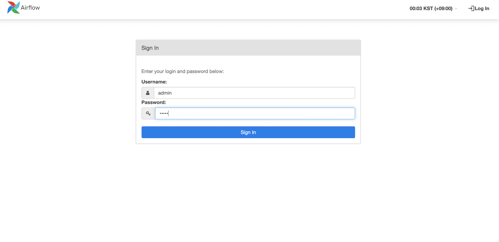
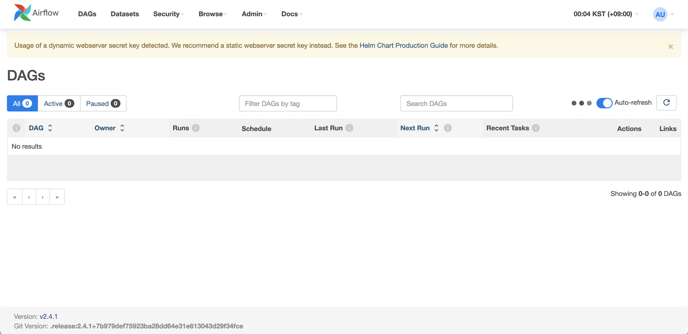
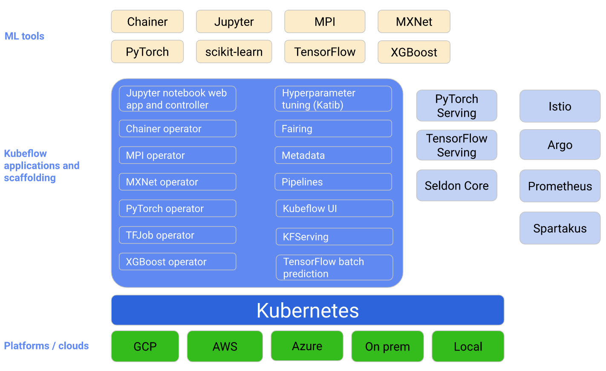
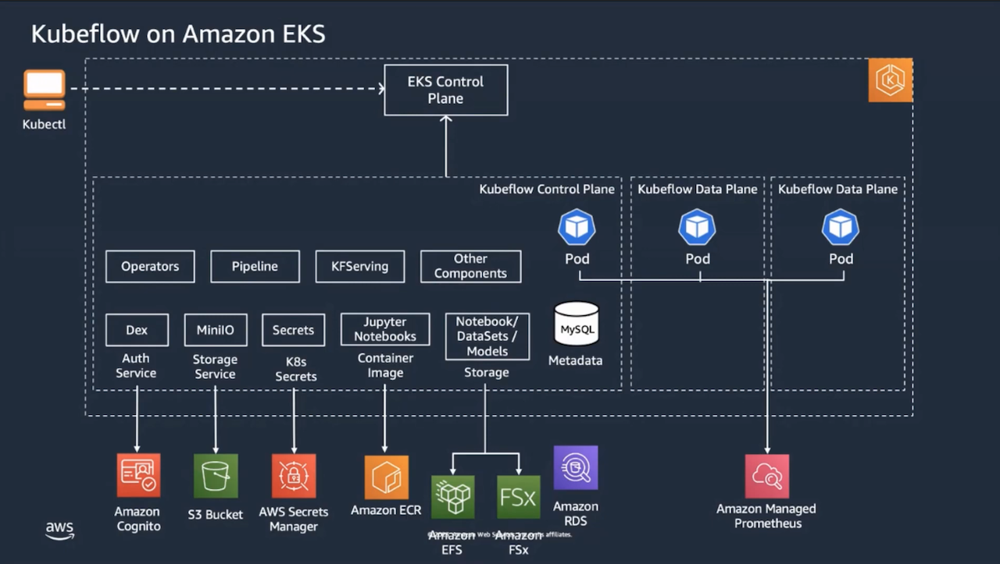
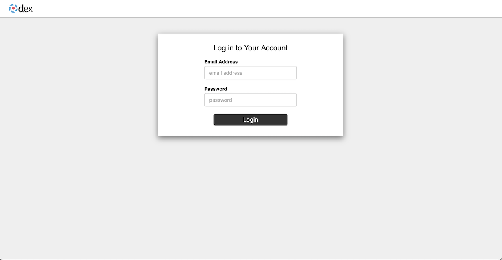
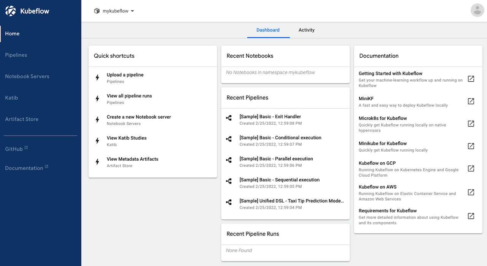
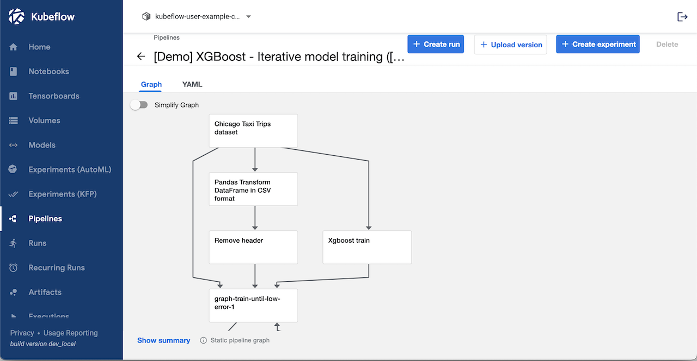

[[English](README.md)] [[한국어](README.ko.md)]

# Data on EKS Blueprint
## Machine Learning
Machine learning is a part of artificial intelligence (AI) and computer science which focuses on the use of data and algorithms to imitate the way that humans learn, gradually improving its accuracy. Machine learning is an important component of the growing field of data science. Through the use of statistical methods, algorithms are trained to make classifications or predictions, and to uncover key insights in data mining projects. These insights subsequently drive decision making within applications and businesses, ideally impacting key growth metrics. As big data continues to expand and grow, the market demand for data scientists will increase. They will be required to help identify the most relevant business questions and the data to answer them. Machine learning algorithms are typically created using frameworks that accelerate solution development, such as TensorFlow and PyTorch.

## Setup
### Prerequisites
This blueprint requires *yq* which is a lightweight command-line YAML, JSON, and XML processor. We will use *yq* to update the settings in the kubeflow configuration file. To install *yq*, follow the [installation guide](https://github.com/mikefarah/yq#install) before you begin. And this module requires also, [kustomize](https://kustomize.io/) for installing kubeflow using manifests. Kustomize is a simple tool lets you customize raw, template-free YAML files for multiple purposes, leaving the original YAML untouched and usable as is. Please follow the [installation guide](https://kubectl.docs.kubernetes.io/installation/kustomize/binaries/) from the official website before moving to the next steps. And make sure you have installed terraform amd kubectl in your environment if you don't have the terraform and kubernetes tools. Go to the main [page](https://github.com/Young-ook/terraform-aws-eks) of this repository and follow the installation instructions.

* yq
* kubectl
* terraform

### Download
Download this example on your workspace
```
git clone https://github.com/Young-ook/terraform-aws-eks
cd terraform-aws-eks/examples/data-ai
```

Then you are in **data-ai** directory under your current workspace. There is an exmaple that shows how to use terraform configurations to create and manage an EKS cluster and Addon utilities on your AWS account. In this example, we will install Kubeflow on Amazon EKS, run a single-node training and inference using TensorFlow.

And clone the awslabs/kubeflow-manifests and the kubeflow/manifests repositories and check out the release branches of your choosing. Substitute the value for KUBEFLOW_RELEASE_VERSION(e.g. v1.6.1) and AWS_RELEASE_VERSION(e.g. v1.6.1-aws-b1.0.0) with the tag or branch you want to use below. Read more about releases and versioning if you are unsure about what these values should be.

```
export KUBEFLOW_RELEASE_VERSION=v1.6.1
export AWS_RELEASE_VERSION=v1.6.1-aws-b1.0.0
git clone https://github.com/awslabs/kubeflow-manifests.git && cd kubeflow-manifests
git checkout ${AWS_RELEASE_VERSION}
git clone --branch ${KUBEFLOW_RELEASE_VERSION} https://github.com/kubeflow/manifests.git upstream && cd -
```

Run terraform:
```
terraform init
terraform apply
```
Also you can use the *-var-file* option for customized paramters when you run the terraform plan/apply command.
```
terraform plan -var-file fixture.tc1.tfvars
terraform apply -var-file fixture.tc1.tfvars
```

### Update kubeconfig
We need to get kubernetes config file for access the cluster that we've made using terraform. After terraform apply, you will see the bash command on the outputs. For more details, please refer to the [user guide](https://github.com/Young-ook/terraform-aws-eks#generate-kubernetes-config).


## Kubernetes Utilities
### Apache 에어플로우(Airflow)
[Apache 에어플로우(Airflow)](https://airflow.apache.org/)는 데이터 엔지니어링 파이프라인을 위한 오픈소스 워크플로우 관리 플랫폼입니다. Airflow의 확장 가능한 Python 프레임워크를 사용하면 거의 모든 기술과 연결되는 워크플로를 구축할 수 있습니다. 또한 웹 인터페이스를 통행 워크플로 상태를 관리할 수 있습니다. 에어플로우는 랩톱의 단일 프로세스부터 대규모 워크플로를 지원하는 분산 환경까지 다양한 방식으로 배포할 수 있습니다. 에어플로우는 2014년 10월에 Airbnb의 복잡해지는 워크플로우 관리를 위한 솔루션으로 시작하였습니다.

#### 에어플로우 접속하기
설치가 되었다면, 다음과 같은 명령을 통해 상태를 확인할 수 있습니다.
```
kubectl -n airflow get all
```

모든 설정이 문제 없어 보인다면, 다음 단계로 이동해도 좋습니다. 에어플로우 대시보드에 연결하기 위해서 포트 포워딩을 실행합니다:
```
kubectl -n airflow port-forward svc/airflow-webserver 8080:8080
```

브라우저에서 `localhost:8080` 주소를 열면, 로그인 화면을 볼 수 있습니다.

**[경고]** 이 예제에서는 기존 사용자(`admin`)와 암호(`admin`)를 사용합니다. 운영환경을 위해 애어플로우를 설치한 경우라면, 반드시 초기 비밀번호를 변경해야 합니다.




### Kubeflow
[Kubeflow](https://www.kubeflow.org/) is an open-source software project that provides a simple, portable, and scalable way of running Machine Learning workloads on Kubernetes. Below is the kubeflow platform diagram.




#### Access Kubeflow dashboard
Run below command to check the status.
```
kubectl -n kubeflow get all
```

Everything looks good, move forward to the next step. Run port-forward commend to access Kubeflow dashboard:
```
kubectl port-forward svc/istio-ingressgateway -n istio-system 8080:80
```

Open `localhost:8080` in your favorite browswer. You will see the login page.

**[WARNING]** In both options, we use a default email (`user@example.com`) and password (`12341234`). For any production Kubeflow deployment, you should change the default password by following the relevant section.





#### Kubeflow fairing
Kubeflow fairing streamlines the process of building, training, and deploying machine learning (ML) training jobs in a hybrid cloud environment. By using Kubeflow fairing and adding a few lines of code, you can run your ML training job locally or in the cloud, directly from Python code or a Jupyter notebook. If you want to run hands-on lab about kubeflow fairing with AWS, please follow [the instructions](https://www.eksworkshop.com/advanced/420_kubeflow/fairing/).


## 애플리케이션
- [MNIST on Kubeflow](./apps/README.md#mnist-on-kubeflow)

## 정리
예제를 삭제하기 위하여 테라폼 명령을 실행합니다:
```
terraform destroy
```

삭제 명령을 수행하기 전에 재차 확인하는 과정이 있는데, 이 부분을 바로 넘기려면 테라폼 옵션을 활용할 수 있습니다.
```
terraform destroy --auto-approve
```

**[주의]** 여러 분이 자원을 생성할 때 *-var-file*을 사용했다면, 삭제 할 때에도 반드시 같은 변수 파일을 옵션으로 지정해야 합니다.
```
terraform destroy -var-file fixture.tc1.tfvars
```

# 추가 정보
## AWS Trainium
- [Scaling distributed training with AWS Trainium and Amazon EKS](https://aws.amazon.com/blogs/machine-learning/scaling-distributed-training-with-aws-trainium-and-amazon-eks/)

## Apache Kafka on EKS
- [Deploying and scaling Apache Kafka on Amazon EKS](https://aws.amazon.com/blogs/containers/deploying-and-scaling-apache-kafka-on-amazon-eks/)

## Apache Spark on EKS
- [SQL-based ETL with Apache Spark on Amazon EKS](https://github.com/awslabs/sql-based-etl-with-apache-spark-on-amazon-eks)

## Kubeflow on EKS
- [Kubeflow on AWS](https://awslabs.github.io/kubeflow-manifests/docs/about/)
- [Kubeflow Manifests](https://github.com/awslabs/kubeflow-manifests)
- [Enabling hybrid ML workflows on Amazon EKS and Amazon SageMaker with one-click Kubeflow on AWS deployment](https://aws.amazon.com/blogs/machine-learning/enabling-hybrid-ml-workflows-on-amazon-eks-and-amazon-sagemaker-with-one-click-kubeflow-on-aws-deployment/)

## Data Platform
- [Building a Modern Data Platform on Amazon EKS](https://youtu.be/7AHuMNqbR7o)
- [Data on EKS(DoEKS)](https://awslabs.github.io/data-on-eks/docs/introduction/intro)

## Data Science
- [Python Data Science Handbook](https://jakevdp.github.io/PythonDataScienceHandbook/)

## Mountpoint for Amazon S3 CSI Driver
- [Mountpoint for Amazon S3 CSI Driver](https://github.com/awslabs/mountpoint-s3-csi-driver)
- [Working with Mountpoint for Amazon S3](https://docs.aws.amazon.com/AmazonS3/latest/userguide/mountpoint.html)
