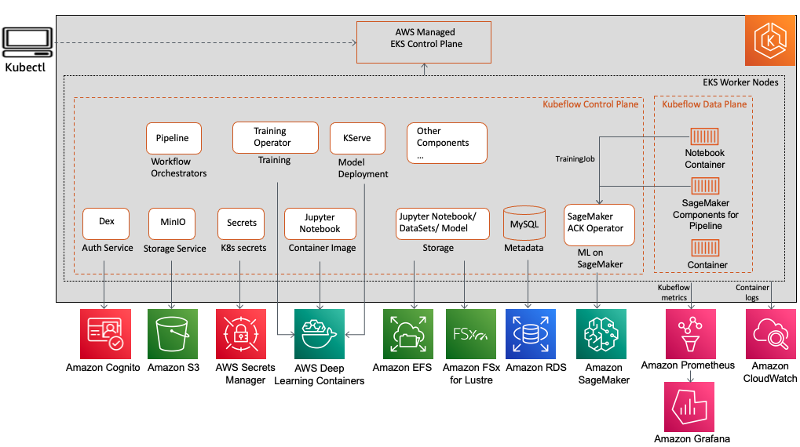

[[English](README.md)] [[한국어](README.ko.md)]

# Data on EKS 블루프린트(Blueprint)
## 기계 학습(Machine Learning)
머신 러닝은 인공지능(Artificial Intelligence, AI)의 한 부분으로 데이터와 알고리즘을 사용하여 인간이 학습하는 방식을 모방하여 점진적으로 정확도를 향상시키는 데 초점을 둔 컴퓨터 과학의 한 분야 입니다. 머신 러닝은 성장하는 데이터 과학 분야에서 중요한 구성 요소이며, 통계적 방법을 사용하여 분류 또는 예측을 하고 데이터 마이닝 프로젝트를 통해 핵심 통찰을 발견하도록 알고리즘을 훈련 시킵니다. 이러한 통찰력은 이후 애플리케이션과 비즈니스 내에서 의사 결정을 내리고 주요 성장 지표에 이상적으로 영향을 끼치게 됩니다. 빅 데이터가 계속 확장되고 성장함에 따라 데이터 과학자에 대한 시장의 수요도 증가할 것이며, 데이터 과학자들은 가장 관련성이 높은 비즈니스 질문과 그에 대한 답을 찾기 위한 데이터를 식별하는 데 도움을 주어야 할 것입니다. 머신 러닝 알고리즘은 일반적으로 TensorFlow 및 PyTorch와 같이 솔루션 개발을 가속화하는 프레임워크를 사용하여 만듭니다.

## 설치
### 필수요소
이 예제에서는 YAML, JSON, XML을 다루기 위한 가벼운 명령줄 도구인 *yq* 이 필요합니다. 쿠브플로우(Kubeflow)의 설정 파일을 변경하기 위해서 *yq* 를 사용할 것입니다. 예제를 시작하기 전에, [설치 안내서](https://github.com/mikefarah/yq#install)의 내용을 참고해서 *yq* 를 설치 하시기 바랍니다. 그리고, 이 모듈은 매니페스트(Manifest)를 사용해서 쿠브플로우를 설치하기 위해 [kustomize](https://kustomize.io/)를 사용합니다.  Kustomize는 템플릿에서 자유로운 원시 YAML 파일을 여러 용도에 맞게 사용자 지정할 수 있는 간단한 도구로, 원본 YAML을 그대로 유지하여 사용할 수 있습니다. 다음 단계로 이동하기 전에 공식 웹사이트의 [설치 안내서](https://kubectl.docs.kubernetes.io/installation/kustomize/binaries/)를 따르시길 바랍니다. 그리고 Terraform 및 Kubernetes 도구가 없는 경우, 이 리포지토리의 메인 [페이지](https://github.com/Young-ook/terraform-aws-eks)의 안내를 따라 설치하시길 바랍니다.

* yq
* kubectl
* terraform

### 내려받기
여러 분의 작업 환경에 예제를 내려받기 합니다.
```
git clone https://github.com/Young-ook/terraform-aws-eks
cd terraform-aws-eks/examples/data-ai
```

작업이 끝나면 **data-ai** 디렉토리를 볼 수 있습니다. 여기에는 테라폼 구성을 사용하여 AWS 계정에서 EKS 클러스터와 애드온 유틸리티를 생성하고 관리하는 예제가 있습니다. 이 예제에서는 Amazon EKS에 Kubeflow를 설치하고, 단일 노드 학습과 TensorFlow를 사용한 추론을 실행할 것입니다.

이제 awslabs/kubeflow-manifests와 kubeflow/manifests 리포지토리를 복제하고 릴리즈 브랜치를 확인 합니다. 아래에 사용하려는 태그 또는 브랜치를 KUBEFLOW_RELEASE_VERSION(예: v1.6.1) 및 AWS_RELEASE_VERSION(예: v1.6.1-aws-b1.0.0)의 값으로 대체 합니다. 어떤 값을 선택해야 할 지 확실하지 않은 경우 릴리스 및 버전에 대해 자세히 읽어보시길 바랍니다.
```
export KUBEFLOW_RELEASE_VERSION=v1.6.1
export AWS_RELEASE_VERSION=v1.6.1-aws-b1.0.0
git clone https://github.com/awslabs/kubeflow-manifests.git && cd kubeflow-manifests
git checkout ${AWS_RELEASE_VERSION}
git clone --branch ${KUBEFLOW_RELEASE_VERSION} https://github.com/kubeflow/manifests.git upstream && cd -
```

테라폼을 실행합니다:
```
terraform init
terraform apply
```
Also you can use the *-var-file* option for customized paramters when you run the terraform plan/apply command.
```
terraform plan -var-file fixture.tc1.tfvars
terraform apply -var-file fixture.tc1.tfvars
```

### 쿠버네티스 환경설정
테라폼을 이용해서 생성한 클러스터에 접속하기 위해서는 쿠버네티스 설정 파일을 받아야 합니다. 테라폼 실행이 끝나면 설정 파일을 내려받을 수 있는 스크립트가 출력됩니다. 보다 자세한 내용은, 다음의 [사용자 안내](https://github.com/Young-ook/terraform-aws-eks#generate-kubernetes-config)를 참고하시기 바랍니다.

## Kubernetes Utilities
### Apache 에어플로우(Airflow)
[Apache 에어플로우(Airflow)](https://airflow.apache.org/)는 데이터 엔지니어링 파이프라인을 위한 오픈소스 워크플로우 관리 플랫폼입니다. Airflow의 확장 가능한 Python 프레임워크를 사용하면 거의 모든 기술과 연결되는 워크플로를 구축할 수 있습니다. 또한 웹 인터페이스를 통행 워크플로 상태를 관리할 수 있습니다. 에어플로우는 랩톱의 단일 프로세스부터 대규모 워크플로를 지원하는 분산 환경까지 다양한 방식으로 배포할 수 있습니다. 에어플로우는 2014년 10월에 Airbnb의 복잡해지는 워크플로우 관리를 위한 솔루션으로 시작하였습니다.

#### 에어플로우 접속하기
설치가 되었다면, 다음과 같은 명령을 통해 상태를 확인할 수 있습니다.
```
kubectl -n airflow get all
```

모든 설정이 문제 없어 보인다면, 다음 단계로 이동해도 좋습니다. 에어플로우 대시보드에 연결하기 위해서 포트 포워딩을 실행합니다:
```
kubectl -n airflow port-forward svc/airflow-webserver 8080:8080
```

브라우저에서 `localhost:8080` 주소를 열면, 로그인 화면을 볼 수 있습니다.

**[경고]** 이 예제에서는 기존 사용자(`admin`)와 암호(`admin`)를 사용합니다. 운영환경을 위해 애어플로우를 설치한 경우라면, 반드시 초기 비밀번호를 변경해야 합니다.


### Kubeflow
[Kubeflow](https://www.kubeflow.org/) is an open-source software project that provides a simple, portable, and scalable way of running Machine Learning workloads on Kubernetes. Below is the kubeflow platform diagram.




#### Access Kubeflow dashboard
Run below command to check the status.
```
kubectl -n kubeflow get all
```

Everything looks good, move forward to the next step. Run port-forward commend to access Kubeflow dashboard:
```
kubectl port-forward svc/istio-ingressgateway -n istio-system 8080:80
```

Open `localhost:8080` in your favorite browswer. You will see the login page.

**[WARNING]** In both options, we use a default email (`user@example.com`) and password (`12341234`). For any production Kubeflow deployment, you should change the default password by following the relevant section.


#### Kubeflow fairing
Kubeflow fairing streamlines the process of building, training, and deploying machine learning (ML) training jobs in a hybrid cloud environment. By using Kubeflow fairing and adding a few lines of code, you can run your ML training job locally or in the cloud, directly from Python code or a Jupyter notebook. If you want to run hands-on lab about kubeflow fairing with AWS, please follow [the instructions](https://www.eksworkshop.com/advanced/420_kubeflow/fairing/).


## 애플리케이션
- [MNIST on Kubeflow](./apps/README.md#mnist-on-kubeflow)

## 정리
예제를 삭제하기 위하여 테라폼 명령을 실행합니다:
```
terraform destroy
```

삭제 명령을 수행하기 전에 재차 확인하는 과정이 있는데, 이 부분을 바로 넘기려면 테라폼 옵션을 활용할 수 있습니다.
```
terraform destroy --auto-approve
```

**[주의]** 여러 분이 자원을 생성할 때 *-var-file*을 사용했다면, 삭제 할 때에도 반드시 같은 변수 파일을 옵션으로 지정해야 합니다.
```
terraform destroy -var-file fixture.tc1.tfvars
```

# 추가 정보
## AWS Trainium
- [Scaling distributed training with AWS Trainium and Amazon EKS](https://aws.amazon.com/blogs/machine-learning/scaling-distributed-training-with-aws-trainium-and-amazon-eks/)

## Analytics on EKS
- [Building a Modern Data Platform on Amazon EKS](https://youtu.be/7AHuMNqbR7o)
- [Data on EKS(DoEKS)](https://awslabs.github.io/data-on-eks/docs/introduction/intro)
- [SQL-based ETL with Apache Spark on Amazon EKS](https://github.com/awslabs/sql-based-etl-with-apache-spark-on-amazon-eks)
- [Working with Mountpoint for Amazon S3](https://docs.aws.amazon.com/AmazonS3/latest/userguide/mountpoint.html)

## Kubeflow
- [Kubeflow on AWS](https://awslabs.github.io/kubeflow-manifests/docs/about/)
- [Kubeflow Manifests](https://github.com/awslabs/kubeflow-manifests)
- [Enabling hybrid ML workflows on Amazon EKS and Amazon SageMaker with one-click Kubeflow on AWS deployment](https://aws.amazon.com/blogs/machine-learning/enabling-hybrid-ml-workflows-on-amazon-eks-and-amazon-sagemaker-with-one-click-kubeflow-on-aws-deployment/)
