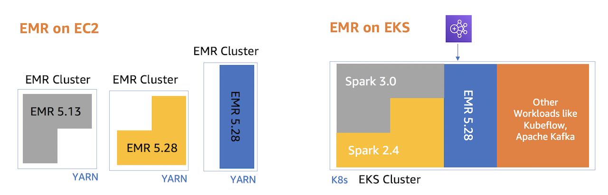

# Amazon EMR (Elastic Map Reduce) on Amazon EKS
[Amazon EMR](https://aws.amazon.com/emr/) is a managed cluster platform that simplifies running big data frameworks, such as Apache Hadoop and Apache Spark, on AWS to process and analyze vast amounts of data. With this deployment, you can easily run and scale Apache Spark, Hive, Presto, and other big data workloads with Amazon EMR.



EMR on EKS decouples the analytics job from the services and infrastructure that are processing the job by using a container-based approach. You can focus more on developing your application and less on operating the infrastructure as EMR on EKS dynamically configures the infrastructure based on the compute, memory, and application dependencies of the job. Infrastructure teams can centrally manage a common compute platform to consolidate EMR workloads with other container-based applications. Multiple teams, organizations, or business units can simultaneously and independently run their analytics processes on the shared infrastructure while maintaining isolation enabled by Amazon EKS and AWS Identity and Access Management (IAM)

If you already run Apache Spark on Amazon EKS, you can get all of the benefits of Amazon EMR like automatic provisioning and scaling and the ability to use the latest fully managed versions of open source big data analytics frameworks. You get an optimized EMR runtime for Apache Spark with 3X faster performance than open source Apache Spark on EKS, a serverless data science experience with EMR Studio and Apache Spark UI, fine grained data access control, and support for data encryption. Your Spark jobs start in seconds vs minutes when compared to EC2 based deployments.

## Download example
Download this example on your workspace
```sh
git clone https://github.com/Young-ook/terraform-aws-eks
cd terraform-aws-eks/examples/emr
```

## Prerequisites
This module requires *eksctl* which is an open-source cli tool for EKS cluster management. In this example, we will use *eksctl* to create kubernetes access control objects for EMR integration. Follow the [instructions](https://github.com/weaveworks/eksctl#installation) for eksctl installation.

## Setup
[This](https://github.com/Young-ook/terraform-aws-eks/blob/main/examples/emr/main.tf) is an example of terraform configuration file to create an Amazon EMR cluster on Amazon EKS. Check out and apply it using terraform command.

If you don't have the terraform and kubernetes tools in your environment, go to the main [page](https://github.com/Young-ook/terraform-aws-eks) of this repository and follow the installation instructions.

### Create an EKS Cluster
Run terraform:
```
terraform init
terraform apply
```
Also you can use the `-var-file` option for customized paramters when you run the terraform plan/apply command.
```
terraform plan -var-file tc1.tfvars
terraform apply -var-file tc1.tfvars
```

### Update kubeconfig
Update and download kubernetes config file to local. You can see the bash command like below after terraform apply is complete. These are utility scripts and commands for managing EMR and EKS clusters. It looks like below.
```
Outputs:

create_emr_containers = "bash -e ./create-emr-virtual-cluster.sh"
delete_emr_containers = "bash -e ./delete-emr-virtual-cluster.sh"
enable_emr_access = "eksctl create iamidentitymapping --cluster eks-emr --service-name emr-containers --namespace default"
kubeconfig = "bash -e .terraform/modules/eks/script/update-kubeconfig.sh -r ap-northeast-2 -n eks-emr -k kubeconfig"
```

Copy and run it to save the kubernetes configuration file to your local workspace. And export it as an environment variable to apply to the terminal.
```
bash -e .terraform/modules/eks/script/update-kubeconfig.sh -r ap-northeast-2 -n eks-emr -k kubeconfig
export KUBECONFIG=kubeconfig
```

### Enabling Access for Amazon EMR
In order to allow EMR to perform operations on the Kubernetes API, its Service-Linked Role (SLR) needs to be granted the required RBAC permissions. *eksctl* provides a command that creates the required RBAC resources for EMR, and updates the aws-auth ConfigMap to bind the role with the SLR for EMR.

Copy the command from terraform outputs. Paste to the your workspace and run:
```
eksctl create iamidentitymapping --cluster eks-emr --service-name emr-containers --namespace default
```

### Create an EMR Virtual Cluster
You can see the path to the script on terraform outputs. One for creating virtual clusters and one for deleting. Copy and run:
```
bash -e ./create-emr-virtual-cluster.sh
```

## Clean up
Delete virtual EMR cluster first:
```
bash -e ./delete-emr-virtual-cluster.sh
```

Run terraform:
```
terraform destroy
```
Don't forget you have to use the `-var-file` option when you run terraform destroy command to delete the aws resources created with extra variable files.
```
terraform destroy -var-file tc1.tfvars
```
