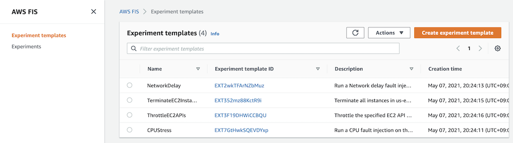
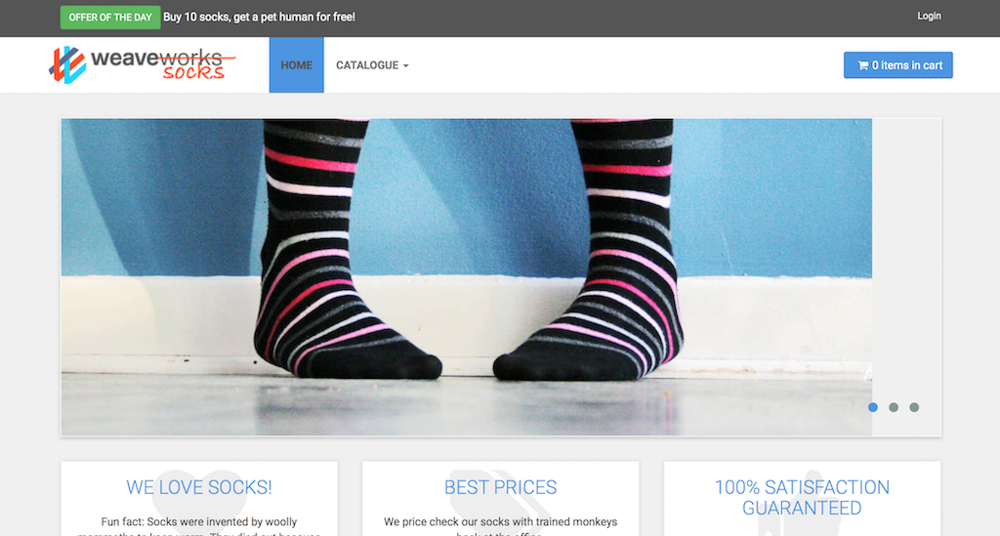
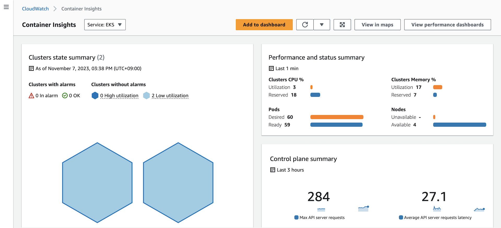
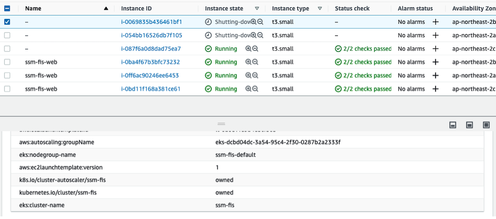
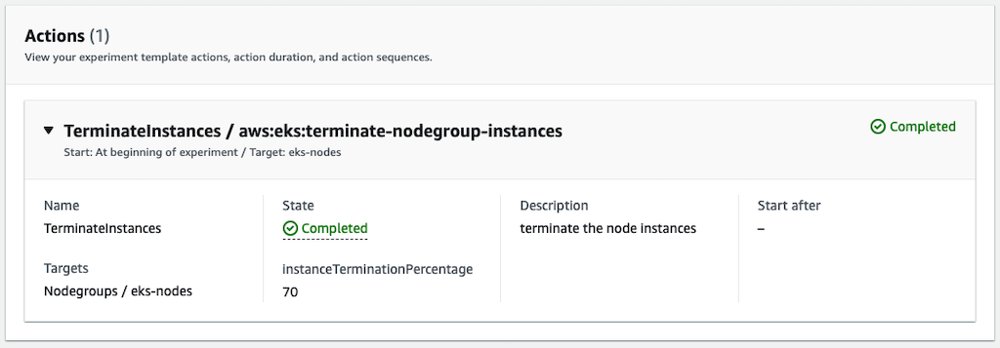

# AWS Fault Injection Simulator
[AWS Fault Injection Simulator](https://aws.amazon.com/fis/) is a fully managed service for running fault injection experiments on AWS that makes it easier to improve an application’s performance, observability, and resiliency. Fault injection experiments are used in chaos engineering, which is the practice of stressing an application in testing or production environments by creating disruptive events, such as sudden increase in CPU or memory consumption, observing how the system responds, and implementing improvements.

## Chaos Engineering
### Why Chaos Engineering
There are many reasons to do chaos engineering. We see teams transitioning in this way to reduce incidents, lower downtime costs, train their teams, and prepare for critical moments. Practicing chaos engineering allows you to detect problems before they become accidents and before customers are affected. And chaos engineering is useful for reducing downtime costs because it allows teams to have a resilient architecture. While the number of companies operating at Internet scale increases and high-traffic events such as sales or launches increase, the cost of downtime will become more expensive. Additionally, this continuous practice of chaos engineering gives teams more confidence every day as they build their own applications and systems. It takes less time to fire-fighting and more time to create and create value.

### How to do Chaos Engineering
To implement Chaos Engineering, one should follow the scientific method to implement experiments:
1. Observe your system
1. Baseline your metrics
1. Define Steady State
1. Form a Hypothesis with Abort Conditions (Blast Radius)
1. Run Experiment
1. Analyze Results
1. Expand Scope and Re-Test
1. Share Results

## Setup
[This](https://github.com/Young-ook/terraform-aws-eks/blob/main/examples/fis/main.tf) is an example of terraform configuration file to create AWS Fault Injection Simulator experiments for chaos engineering. Check out and apply it using terraform command.

Run terraform:
```
terraform init
terraform apply
```
Also you can use the `-var-file` option for customized paramters when you run the terraform plan/apply command.
```
terraform plan -var-file tc1.tfvars
terraform apply -var-file tc1.tfvars
```

## Create Experiment Templates
Run script
```
./fis-create-experiment-templates.sh
```
This script creates fault injection simulator experiment templates on the AWS account. Move to the AWS FIS service page on the AWS Management Conosol and select Experiment templates menu on the left. Then users will see the created experiment templates for chaos engineering.



## Run Experiments
To test your environment, select a experiment template that you want to run and click the `Actions` button on the right top on the screen. You will see `Start experiment` in the middle of poped up menu and select it. And follow the instructions.

### Terminate EKS Nodes
AWS FIS allows you to test resilience of EKS cluster node groups. See what happens if you shut down some ec2 nodes for kubernetes pods or services within a certain percentage. This test verifies that the EKS managed node group launches new instances to meet the defined desired capacity and ensures that the application containers continues to run well. Also, this test will help you understand what happens to your application when you upgrade your cluster. At this time, in order to satisfy both resiliency and ease of cluster upgrade, the container should be designed so that it can be moved easily. This makes it easy to move containers running on the failed node to another node to continue working. This is an important part of a cloud-native architecture.

#### Update kubeconfig
Update and download kubernetes config file to local. You can see the bash command like below after terraform apply is complete. Copy this and run it to save the kubernetes configuration file to your local workspace. And export it as an environment variable to apply to the terminal.
```
bash -e .terraform/modules/eks/script/update-kubeconfig.sh -r ap-northeast-2 -n ssm-fis -k kubeconfig
export KUBECONFIG=kubeconfig
```

#### Microservices Architecture Application
For this lab, we picked up the Sock Shop application. Sock Shop is a microservices architecture sample application that Weaveworks initially developed. They made it open source so it can be used by other organizations for learning and demonstration purposes.

Create the namespace and deploy application.
```
kubectl apply -f manifests/sockshop-complete-demo.yaml
```
Verify that the pod came up fine (ensure nothing else is running on port 8079):
```
kubectl -n sock-shop get pod -l name=front-end
```
The output will be something like this:
```
NAME                         READY   STATUS    RESTARTS   AGE
front-end-7b8bcd59cb-wd527   1/1     Running   0          9s
```

##### Local Workspace
In your local workspace, connect through a proxy to access your application's endpoint.
```
kubectl -n sock-shop port-forward svc/front-end 8080:80
```
Open `http://localhost:8080` on your web browser. This shows the Sock Shop main page.

##### Cloud9
In your Cloud9 IDE, run the application.
```
kubectl -n sock-shop port-forward svc/front-end 8080:80
```
Click `Preview` and `Preview Running Application`. This opens up a preview tab and shows the Sock Shop main page.



🎉 Congrats, you’ve deployed the sample application on your cluster.

#### Run Load Generator
Run load generator inside kubernetes
```
kubectl apply -f manifests/sockshop-loadtest.yaml
```

#### Define Steady State
Before we begin a failure experiment, we need to validate the user experience and revise the dashboard and metrics to understand that the systems are working under normal state, in other words, steady state.



Let’s go ahead and explore Sock Shop application. Some things to try out:
1. Register and log in using the below credentials (These are very secure so please don’t share them)
    * Username: `user`
    * Password: `password`
1. View various items
1. Add items to cart
1. Remove items from cart
1. Check out items

#### Run Experiment
Go to the AWS FIS service page and select `TerminateEKSNodes` from the list of experiment templates. Then use the on-screen `Actions` button to start the experiment. AWS FIS shuts down EKS nodes for up to 70% of currently running instances. In this experiment, this value is 30% and it is configured in the experiment template. You can edit this value in the target selection mode configuration if you want to change the number of EKS nodes to shut down You can see the terminated instances on the EC2 service page, and the new instances will appear shortly after the EKS node is shut down.





#### Architecture Improvements
Scale out pods for high availability.
```
kubectl -n sockshop scale --replicas=3 \
  deployment/front-end deployment/carts deployment/catalogue \
  deployment/orders deployment/payment deployment/shipping \
  deployment/user
```

#### Rerun Experiment
Back to the AWS FIS service page, and rerun the terminate eks nodes experiment against the target to ensure that the microservices application is working in the previously assumed steady state.

#### Remove Application
Delete all kubernetes resources.
```
kubectl apply -f manifests/sockshop-complete-demo.yaml
kubectl apply -f manifests/sockshop-loadtest.yaml
```

## Clean up
### Delete experiment templates
Run script
```
./fis-delete-experiment-templates.sh
```

### Delete infrastructure
Run terraform:
```
terraform destroy
```
Don't forget you have to use the `-var-file` option when you run terraform destroy command to delete the aws resources created with extra variable files.
```
terraform destroy -var-file tc1.tfvars
```
