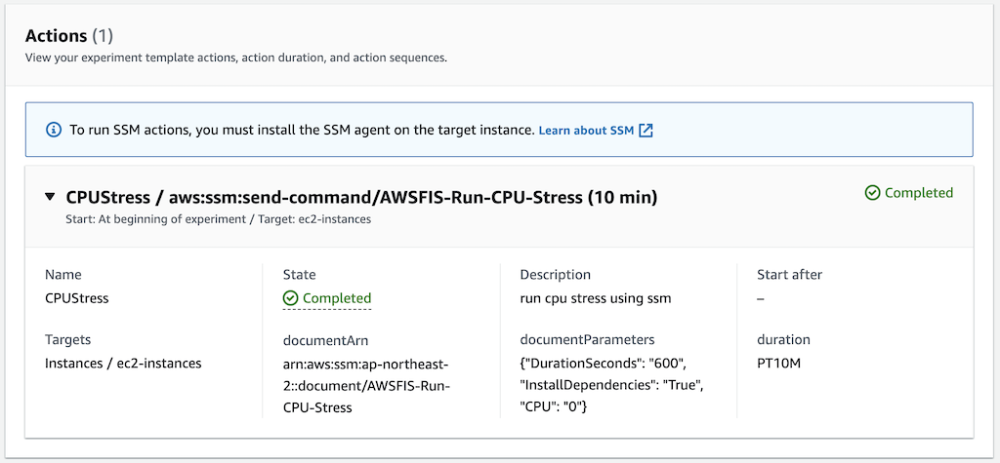
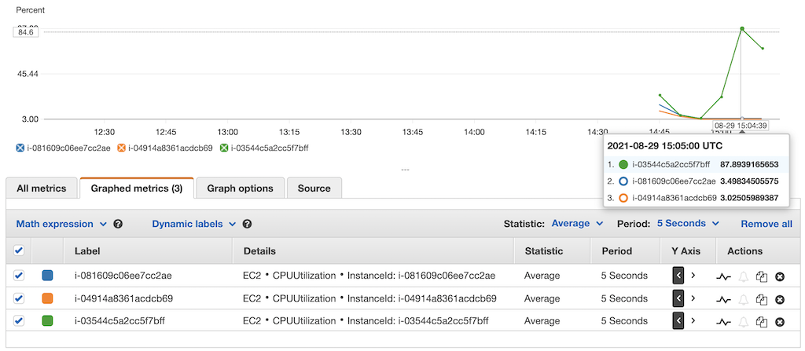
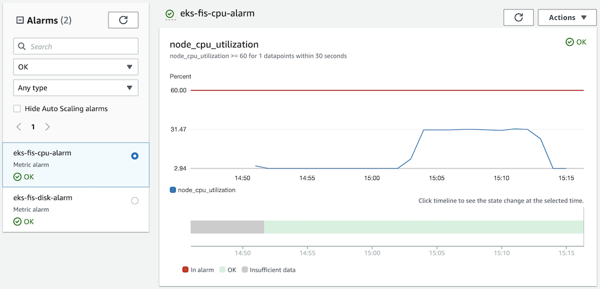

# AWS Fault Injection Simulator
[AWS Fault Injection Simulator](https://aws.amazon.com/fis/) is a fully managed service for running fault injection experiments on AWS that makes it easier to improve an application’s performance, observability, and resiliency. Fault injection experiments are used in chaos engineering, which is the practice of stressing an application in testing or production environments by creating disruptive events, such as sudden increase in CPU or memory consumption, observing how the system responds, and implementing improvements.

## Chaos Engineering
### Why Chaos Engineering
There are many reasons to do chaos engineering. We see teams transitioning in this way to reduce incidents, lower downtime costs, train their teams, and prepare for critical moments. Practicing chaos engineering allows you to detect problems before they become accidents and before customers are affected. And chaos engineering is useful for reducing downtime costs because it allows teams to have a resilient architecture. While the number of companies operating at Internet scale increases and high-traffic events such as sales or launches increase, the cost of downtime will become more expensive. Additionally, this continuous practice of chaos engineering gives teams more confidence every day as they build their own applications and systems. It takes less time to fire-fighting and more time to create and create value.

### How to do Chaos Engineering
To implement Chaos Engineering, one should follow the scientific method to implement experiments:
1. Observe your system
1. Baseline your metrics
1. Define Steady State
1. Form a Hypothesis with Abort Conditions (Blast Radius)
1. Run Experiment
1. Analyze Results
1. Expand Scope and Re-Test
1. Share Results

## Download example
Download this example on your workspace
```sh
git clone https://github.com/Young-ook/terraform-aws-eks
cd terraform-aws-eks/examples/fis
```

## Setup
[This](https://github.com/Young-ook/terraform-aws-eks/blob/main/examples/fis/main.tf) is an example of terraform configuration file to create AWS Fault Injection Simulator experiments for chaos engineering. Check out and apply it using terraform command.

If you don't have the terraform and kubernetes tools in your environment, go to the main [page](https://github.com/Young-ook/terraform-aws-eks) of this repository and follow the installation instructions.

### Create Cluster
Run terraform:
```
terraform init
terraform apply
```
Also you can use the `-var-file` option for customized paramters when you run the terraform plan/apply command.
```
terraform plan -var-file tc1.tfvars
terraform apply -var-file tc1.tfvars
```
### Update kubeconfig
Update and download kubernetes config file to local. You can see the bash command like below after terraform apply is complete. The output looks like below. Copy and run it to save the kubernetes configuration file to your local workspace. And export it as an environment variable to apply to the terminal.
```
bash -e .terraform/modules/eks/script/update-kubeconfig.sh -r ap-northeast-2 -n eks-fis -k kubeconfig
export KUBECONFIG=kubeconfig
```

### Microservices Architecture Application
For this lab, we picked up the Sock Shop application. Sock Shop is a microservices architecture sample application that Weaveworks initially developed. They made it open source so it can be used by other organizations for learning and demonstration purposes.

Create the namespace and deploy application.
```
kubectl apply -f manifests/sockshop-demo.yaml
```
Verify that the pod came up fine (ensure nothing else is running on port 8079):
```
kubectl -n sockshop get pod -l name=front-end
```
The output will be something like this:
```
NAME                         READY   STATUS    RESTARTS   AGE
front-end-7b8bcd59cb-wd527   1/1     Running   0          9s
```

#### Local Workspace
In your local workspace, connect through a proxy to access your application's endpoint.
```
kubectl -n sockshop port-forward svc/front-end 8080:80
```
Open `http://localhost:8080` on your web browser. This shows the Sock Shop main page.

#### Cloud9
In your Cloud9 IDE, run the application.
```
kubectl -n sockshop port-forward svc/front-end 8080:80
```
Click `Preview` and `Preview Running Application`. This opens up a preview tab and shows the Sock Shop main page.


🎉 Congrats, you’ve deployed the sample application on your cluster.

### Run Load Generator
Run load generator inside kubernetes
```
kubectl apply -f manifests/sockshop-loadtest.yaml
```

## Fault Injection Experiments
This module creates fault injection simulator experiment templates when creating. Move to the AWS FIS service page on the AWS Management Conosol and select Experiment templates menu on the left. Then you will see the created experiment templates for chaos engineering. To test your environment, select a experiment template that you want to run and click the `Actions` button on the right top on the screen. You will see `Start experiment` in the middle of poped up menu and select it. And follow the instructions.


### Terminate EKS Nodes
AWS FIS allows you to test resiliency of EKS cluster node groups. See what happens if you shut down some ec2 nodes for kubernetes pods or services within a certain percentage. This test verifies that the EKS managed node group launches new instances to meet the defined desired capacity and ensures that the application containers continues to run well. Also, this test will help you understand what happens to your application when you upgrade your cluster. At this time, in order to satisfy both resiliency and ease of cluster upgrade, the container should be designed so that it can be moved easily. This makes it easy to move containers running on the failed node to another node to continue working. This is an important part of a cloud-native architecture.

#### Define Steady State
Before we begin a failure experiment, we need to validate the user experience and revise the dashboard and metrics to understand that the systems are working under normal state, in other words, steady state.


Let’s go ahead and explore Sock Shop application. Some things to try out:
1. Register and log in using the below credentials (These are very secure so please don’t share them)
    * Username: `user`
    * Password: `password`
1. View various items
1. Add items to cart
1. Remove items from cart
1. Check out items

#### Run Experiment
Make sure that all your EKS node group instances are running. Go to the AWS FIS service page and select `TerminateEKSNodes` from the list of experiment templates. Then use the on-screen `Actions` button to start the experiment. AWS FIS shuts down EKS nodes for up to 70% of currently running instances. In this experiment, this value is 40% and it is configured in the experiment template. You can edit this value in the target selection mode configuration if you want to change the number of EKS nodes to shut down You can see the terminated instances on the EC2 service page, and the new instances will appear shortly after the EKS node is shut down.


You can see the nodes being shut down in the cluster:
```
kubectl -n sockshop get node -w
NAME                                            STATUS   ROLES    AGE     VERSION
ip-10-1-1-205.ap-northeast-2.compute.internal   Ready    <none>   21m     v1.20.4-eks-6b7464
ip-10-1-9-221.ap-northeast-2.compute.internal   Ready    <none>   4m40s   v1.20.4-eks-6b7464
ip-10-1-9-221.ap-northeast-2.compute.internal   NotReady   <none>   4m40s   v1.20.4-eks-6b7464
ip-10-1-9-221.ap-northeast-2.compute.internal   NotReady   <none>   4m40s   v1.20.4-eks-6b7464
```

#### Architecture Improvements
Cluster Autoscaler is a tool that automatically adjusts the size of the Kubernetes cluster when one of the following conditions is true:
+ there are pods that failed to run in the cluster due to insufficient resources.
+ there are nodes in the cluster that have been underutilized for an extended period of time and their pods can be placed on other existing nodes.

Cluster Autoscaler provides integration with Auto Scaling groups. Cluster Autoscaler will attempt to determine the CPU, memory, and GPU resources provided by an EC2 Auto Scaling Group based on the instance type specified in its Launch Configuration or Launch Template. Click [here](https://github.com/kubernetes/autoscaler/tree/master/cluster-autoscaler/cloudprovider/aws) for more information.

Watch the logs to verify cluster autoscaler is installed properly. If everything looks good, we are now ready to scale our cluster.
```
kubectl -n kube-system logs -f deployment/cluster-autoscaler
```

Scale out pods for high availability.
```
kubectl apply -f manifests/sockshop-demo-ha.yaml
```

#### Rerun Experiment
Back to the AWS FIS service page, and rerun the terminate eks nodes experiment against the target to ensure that the microservices application is working in the previously assumed steady state.

### CPU Stress
AWS FIS allows you to test resiliency of EKS cluster node groups. See what happens on your application when your EKS nodes (ec2 instances) has very high CPU utilization. This test verifies that the application on the EKS managed node group works properly even with increased CPU utilization.

#### Run Experiment
Make sure that all your EKS node group instances are running. Go to the AWS FIS service page and select `CPUStress` from the list of experiment templates. Then use the on-screen `Actions` button to start the experiment. In this experiment, AWS FIS increases CPU utilization for half of the ec2 instances with the env=prod tag. You can change the target percentage of an experiment in the experiment template. To change the number of EKS nodes to which the CPU stress experiment will be applied, edit the filter or tag values in the target selection mode configuration in the template. After starting the experiment, you can see the CPU utilization increase on the EC2 service page or the CloudWatch service page.







## Clean up
### Remove Application
Delete all kubernetes resources.
```
kubectl delete -f manifests/sockshop-demo-ha.yaml
kubectl delete -f manifests/sockshop-loadtest.yaml
```
### Remove Infrastructure
Run terraform:
```
terraform destroy
```
Don't forget you have to use the `-var-file` option when you run terraform destroy command to delete the aws resources created with extra variable files.
```
terraform destroy -var-file tc1.tfvars
```
