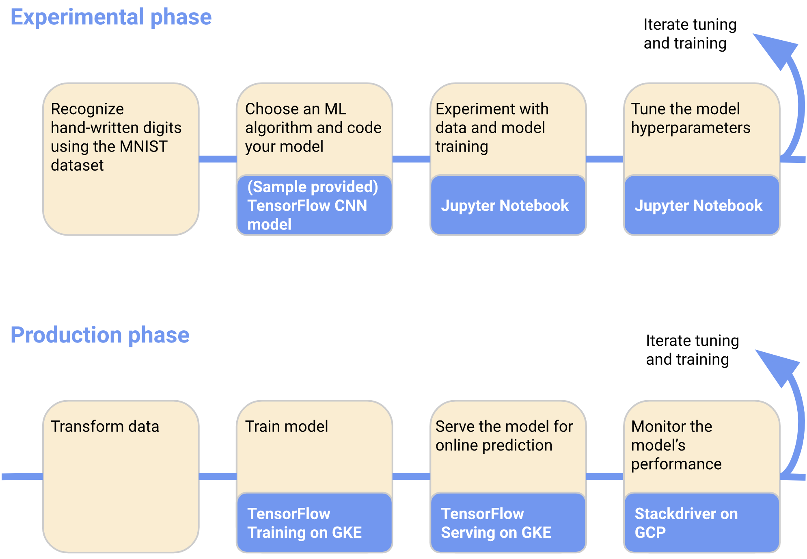

[[English](README.md)] [[한국어](README.ko.md)]

# Applications
## MNIST on Kubeflow on AWS
The following diagram shows a simple example of a specific ML workflow that you can use to train and serve a model trained on the MNIST dataset:


Follow these instructions to run the MNIST tutorial on AWS
1. Follow the [instructions](../README.md) to deploy Kubeflow on AWS
1. Launch a Jupyter notebook
   * The tutorial has been tested using the Jupyter Tensorflow 1.15 image
1. Launch a terminal in Jupyter and clone the kubeflow examples repo
   ```
   git clone https://github.com/kubeflow/examples.git git_kubeflow-examples
   ```
   * **Tip** When you start a terminal in Jupyter, run the command `bash` to start
      a bash terminal which is much more friendly then the default shell
   * **Tip** You can change the URL from '/tree' to '/lab' to switch to using Jupyterlab
1. Open the notebook `mnist/mnist_aws.ipynb`
1. Follow the notebook to train and deploy MNIST on Kubeflow

# Known Issues
