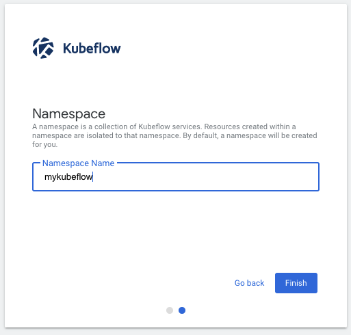

[[English](README.md)] [[한국어](README.ko.md)]

# Machine Learning
Machine learning is a part of artificial intelligence (AI) and computer science which focuses on the use of data and algorithms to imitate the way that humans learn, gradually improving its accuracy. Machine learning is an important component of the growing field of data science. Through the use of statistical methods, algorithms are trained to make classifications or predictions, and to uncover key insights in data mining projects. These insights subsequently drive decision making within applications and businesses, ideally impacting key growth metrics. As big data continues to expand and grow, the market demand for data scientists will increase. They will be required to help identify the most relevant business questions and the data to answer them. Machine learning algorithms are typically created using frameworks that accelerate solution development, such as TensorFlow and PyTorch.

# Kubeflow
[Kubeflow](https://www.kubeflow.org/) is an open-source software project that provides a simple, portable, and scalable way of running Machine Learning workloads on Kubernetes. Below is the kubeflow platform diagram.


## Setup
### Prerequisites
This module requires *yq* which is a lightweight command-line YAML, JSON, and XML processor. We will use *yq* to update the settings in the kubeflow configuration file. To install *yq*, follow the [installation guide](https://github.com/mikefarah/yq#install) before you begin. And if you don't have the terraform and kubernetes tools in your environment, go to the main [page](https://github.com/Young-ook/terraform-aws-eks) of this repository and follow the installation instructions.

### Download
Download this example on your workspace
```
git clone https://github.com/Young-ook/terraform-aws-eks
cd terraform-aws-eks/examples/mlops
```

Then you are in **mlops** directory under your current workspace. There is an exmaple that shows how to use terraform configurations to create and manage an EKS cluster and Addon utilities on your AWS account. In this example, we will install Kubeflow on Amazon EKS, run a single-node training and inference using TensorFlow. Check out and apply it using terraform command. If you don't have the terraform and kubernetes tools in your environment, go to the main [page](https://github.com/Young-ook/terraform-aws-eks) of this repository and follow the installation instructions before you move to the next step.

Run terraform:
```
terraform init
terraform apply
```
Also you can use the *-var-file* option for customized paramters when you run the terraform plan/apply command.
```
terraform plan -var-file fixture.tc1.tfvars
terraform apply -var-file fixture.tc1.tfvars
```

### Update kubeconfig
We need to get kubernetes config file for access the cluster that we've made using terraform. After terraform apply, you will see the bash command on the outputs. For more details, please refer to the [user guide](https://github.com/Young-ook/terraform-aws-eks#generate-kubernetes-config).

### Install kfctl
Download **kfctl**, the command-line tool for Kubeflow, and let it run anywhere on your system.

#### macOS
```
curl --location "https://github.com/kubeflow/kfctl/releases/download/v1.0.2/kfctl_v1.0.2-0-ga476281_darwin.tar.gz" | tar zx -C /tmp
sudo mv -v /tmp/kfctl /usr/local/bin
```
#### Linux
```
curl --location "https://github.com/kubeflow/kfctl/releases/download/v1.0.2/kfctl_v1.0.2-0-ga476281_linux.tar.gz" | tar xz -C /tmp
sudo mv -v /tmp/kfctl /usr/local/bin
```

To install an alternate or newer version, visit the official project [repository](https://github.com/kubeflow/kfctl/tags) and download the archive what you want.

### Deploy Kubeflow
You will find *install* script on your current workspace after terraform apply is complete. That is a bash script to install the kubeflow to the EKS cluster.
```
bash kfinst.sh
```

Run below command to check the status
```
kubectl -n kubeflow get all
```

### Access Kubeflow dashboard
Use port-forward to access Kubeflow dashboard.
```
kubectl port-forward svc/istio-ingressgateway -n istio-system 8080:80
```

Open `localhost:8080` in your favorite browswer. Click on *Start Setup* and then specify the namespace as *mykubeflow*



### Kubeflow fairing
Kubeflow fairing streamlines the process of building, training, and deploying machine learning (ML) training jobs in a hybrid cloud environment. By using Kubeflow fairing and adding a few lines of code, you can run your ML training job locally or in the cloud, directly from Python code or a Jupyter notebook. If you want to run hands-on lab about kubeflow fairing with AWS, please follow [the instructions](https://www.eksworkshop.com/advanced/420_kubeflow/fairing/).

## Clean up
Undeploy kubeflow from your cluster:
```
bash kfuninst.sh
```

To destroy all infrastrcuture, run terraform:
```
terraform destroy
```

If you don't want to see a confirmation question, you can use quite option for terraform destroy command
```
terraform destroy --auto-approve
```

**[DON'T FORGET]** You have to use the *-var-file* option when you run terraform destroy command to delete the aws resources created with extra variable files.
```
terraform destroy -var-file fixture.tc1.tfvars
```

# Additional Resources
## Kubeflow on AWS
- [Kubeflow on AWS](https://github.com/awslabs/kubeflow-manifests)
